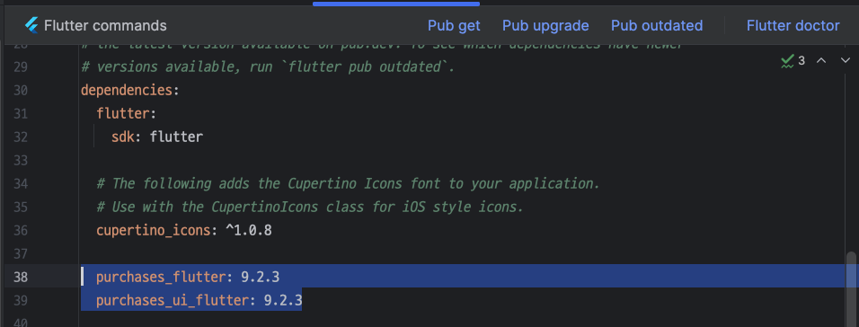
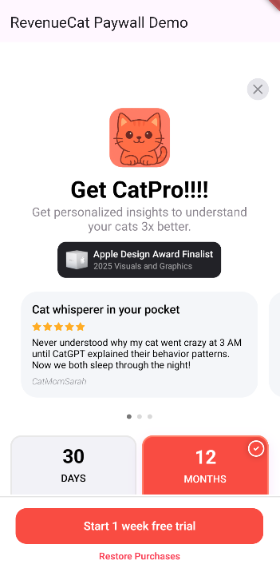

author: Jaewoong Eum
summary: RevenueCat Flutter SDL Integration
id: codelab-4-flutter-sdk
categories: codelab,markdown
environments: Web
status: Published
feedback link: https://github.com/revenuecat/codelab/issues/new
analytics_ga4_account: G-0MLNVKXFGBq

# Flutter In-App Purchases & Paywalls

## Flutter In-App Purchases & Paywalls Overview
Duration: 0:02:00

Welcome to [RevenueCat](https://www.revenuecat.com/)'s Flutter SDK Codelab!

**Goal:** In this codelab, you will learn how to integrate the RevenueCat Flutter SDK into a new Flutter application to fetch product offerings and display a pre-built, native paywall UI.

**What you'll build:**

A simple one-screen app that shows a loading indicator, fetches your configured "Offering" from RevenueCat, and then displays the `PaywallView`.

### Prerequisites

Before you start, you must have the following set up:

1.  **Flutter SDK:** Your Flutter development environment should be ready.
2.  **RevenueCat Account:** A free account at [revenuecat.com](https://revenuecat.com).
3.  **App Store / Play Store Configuration:**
    *   An in-app product (subscription or one-time purchase) created in either App Store Connect or Google Play Console. If you want to learn more about configuring Google Play, check out [Codelab1: RevenueCat Google Play Integration](https://revenuecat.github.io/codelab/google-play/codelab-1-google-play-integration/index.html#0).
    *   This product linked to an **Entitlement** and an **Offering** within your RevenueCat dashboard. This is the most critical step. If you have no "Current" offering, the paywall will not show.
4.  **A Physical Device or Configured Emulator:** For testing in-app purchases.

By the end of this codelab, you’ll be able to successfully implement in-app purchases in your Flutter app and display dynamic paywalls using RevenueCat's Flutter SDK.


## Import RevenueCat SDK
Duration: 0:05:00

First things first, before implementing in-app purchases, you’ll need to import the RevenueCat SDK into your existing or new project. To get started, add the following dependency to your `pubspec.yaml` file:

You can check out the [latest release version on GitHub](https://github.com/RevenueCat/purchases-flutter/releases).

```gradle
dependencies:
  purchases_flutter: 9.2.3
  purchases_ui_flutter: 9.2.3
```

Once you've added those dependencies like the image below, you should click the "Pub get" button, and it will automatically download required dependencies.



Now, let's initialize the RevenueCat SDK. We will do this in the `main.dart` file.

1.  Open `lib/main.dart` and replace its entire content with the following code.
2.  **Paste your API keys** into the `_androidApiKey` and `_iosApiKey` constants.

```dart
// lib/main.dart

import 'package:flutter/material.dart';
import 'package:purchases_flutter/purchases_flutter.dart';
import 'dart:io' show Platform;

// --- PASTE YOUR REVENUECAT KEYS HERE ---
const String _androidApiKey = "goog_YOUR_KEY_HERE";
const String _iosApiKey = "appl_YOUR_KEY_HERE";

void main() async {
  // Ensure Flutter widgets are initialized before any async plugin calls
  WidgetsFlutterBinding.ensureInitialized();

  // Initialize RevenueCat SDK before running the app
  await _initializeRevenueCat();

  runApp(const MyApp());
}

Future<void> _initializeRevenueCat() async {
  // Enable debug logs for development
  await Purchases.setLogLevel(LogLevel.debug);

  PurchasesConfiguration? configuration;
  if (Platform.isAndroid) {
    configuration = PurchasesConfiguration(_androidApiKey);
  } else if (Platform.isIOS) {
    configuration = PurchasesConfiguration(_iosApiKey);
  } else {
    print("RevenueCat not configured for this platform.");
    return;
  }

  try {
    await Purchases.configure(configuration);
    print("RevenueCat configured successfully!");
  } catch (e) {
    print("Error configuring RevenueCat: $e");
  }
}

// ... Rest of the code will go here in the next steps ...
```

We just created an `async main` function. This allows us to `await` the `_initializeRevenueCat` function, guaranteeing that the RevenueCat SDK is configured and ready before any UI is built. This is the correct way to initialize plugins that need to be available right from the start.

Yes! You’ve now completed 50% of the implementation.

## Validating Entitlements
Duration: 0:03:00

Now let’s move on to validating user entitlements.

As mentioned earlier, an entitlement represents the level of access or features a user unlocks after making a purchase. This makes it useful for determining things like whether to display an ad banner or grant premium access.

You can easily check if a user has an active entitlement using the code snippet below:

```dart
const ENTITLEMENT_IDENTIFIER = ".."; // get specific entitlement identifier from your RevenueCat dashboard
final customerInfo = await Purchases.getCustomerInfo();
final isEntitled = customerInfo.entitlements.active[ENTITLEMENT_IDENTIFIER]?.isActive;
```

Once you’ve checked whether the user has a specific entitlement, you can decide how to proceed based on your app’s business model.

For example, if your app is ad-supported, you might choose to show or hide an AdMob banner. Alternatively, you could choose to display a paywall or purchase dialog, allowing users to unlock advanced features or content.

Here’s an example of how you might implement that logic:

```dart
if (isEntitled == true) {
// if the user is granted access to this entitlement. don't need to display a banner.
} else {
// display a banner UI here or display a paywall
..
}
```

## Implement In-App Purchases
Duration: 0:04:00

Now, let’s implement in-app purchases to offer an ad-free experience. To get started, you’ll first need to fetch the relevant product information from your RevenueCat dashboard. This product data will be used to present purchase options to your users.

You can retrieve the available products by calling `Purchases.sharedInstance.awaitGetProducts()`, as shown in the example below:

```dart
// fetches the product information from the Revenue-Cat server
final List<StoreProduct> products = await Purchases.getProducts(['paywall_tester.subs']);

// proceed in-app purchases
final purchaseResult = await Purchases.purchaseStoreProduct(products.first);
```

If you offer multiple product variations, such as `paywall_tester.subs:weekly`, `paywall_tester.subs:monthly`, and `paywall_tester.subs:yearly`, you can simplify product retrieval by using the **base product identifier**, `paywall_tester.subs`, as the value for the `productIds` field. This tells RevenueCat to fetch **all related product variations** as a list, so you can dynamically present them in your paywall UI.

Once you've retrieved the product data, you can initiate the **in-app purchase flow** by calling `Purchases.sharedInstance.awaitPurchase(product)`. This will automatically trigger the **Google Play purchase dialog**, enabling the user to complete the transaction within your app.

Just like that, you've integrated a fully functional **in-app purchase flow** with just a few lines of code—no need to deal with the complexity of handling receipts, store APIs, or purchase validation manually.

So the full example of code will look like below:

```dart
import 'package:flutter/services.dart';
import 'package:purchases_flutter/purchases_flutter.dart';

/// Fetches a specific product by its ID and initiates the purchase flow.
///
/// This function handles potential errors like the product not being found,
/// the user canceling the purchase, or other store errors.
Future<void> purchaseProduct() async {
  // 1. Define the product identifier you want to fetch.
  const String productId = 'paywall_tester.subs';

  try {
    // 2. Fetch the StoreProduct(s) from RevenueCat
    print('Fetching products...');
    final List<StoreProduct> products = await Purchases.getProducts([productId]);

    // 3. Check if the product list is not empty
    if (products.isEmpty) {
      print('Error: Product not found. Check the ID and your RevenueCat setup.');
      // Optionally, show an error message to the user
      return;
    }

    final StoreProduct productToPurchase = products.first;
    print('Product found: ${productToPurchase.title}. Initiating purchase...');

    // 4. Initiate the purchase flow
    final CustomerInfo customerInfo = await Purchases.purchaseStoreProduct(productToPurchase);

    // 5. Check if the purchase was successful by verifying the entitlement
    // Replace "your_premium_entitlement" with your actual entitlement identifier from RevenueCat
    if (customerInfo.entitlements.all["your_premium_entitlement"]?.isActive ?? false) {
      print('Purchase successful! User now has premium access.');
      // Grant access to premium content
    } else {
      print('Purchase completed, but entitlement is not active.');
    }
  } on PlatformException catch (e) {
    // 6. Handle potential errors
    final PurchasesError error = PurchasesErrorHelper.getErrorCode(e);
    if (error == PurchasesErrorCode.purchaseCancelledError) {
      print('Purchase cancelled by user.');
    } else {
      print('Purchase failed with error: ${e.message}');
    }
  } catch (e) {
    print('An unexpected error occurred: $e');
  }
}
```

## Implement Paywalls
Duration: 0:07:00

Now, it's time to impement Paywalls in dart.

### Step 1: Create the App Shell

Now, let's add the basic Flutter app structure. This includes the `MyApp` widget and a stateful `MyHomePage` widget that will eventually hold our paywall.

Append the following code to your `lib/main.dart` file:

```dart
// lib/main.dart (continued)

class MyApp extends StatelessWidget {
  const MyApp({super.key});

  @override
  Widget build(BuildContext context) {
    return MaterialApp(
      title: 'RevenueCat Paywall Demo',
      theme: ThemeData(
        colorScheme: ColorScheme.fromSeed(seedColor: Colors.deepPurple),
        useMaterial3: true,
      ),
      home: const MyHomePage(title: 'RevenueCat Paywall Demo'),
    );
  }
}

class MyHomePage extends StatefulWidget {
  const MyHomePage({super.key, required this.title});
  final String title;

  @override
  State<MyHomePage> createState() => _MyHomePageState();
}

// ... The State class will be built in the next step ...
```

### Step 2: Fetch Offerings and Handle State

This is the core logic. In the `_MyHomePageState`, we will fetch the offerings from RevenueCat and manage the loading and error states.

Replace the comment `// ... The State class will be built...` with the full `_MyHomePageState` class below:

```dart
// lib/main.dart (continued)

class _MyHomePageState extends State<MyHomePage> {
  // State variables
  Offering? _offering;
  bool _isLoading = true;
  String? _errorMessage;

  @override
  void initState() {
    super.initState();
    // Fetch offerings as soon as the page loads
    _loadOfferings();
  }

  Future<void> _loadOfferings() async {
    // We must ensure the widget is still mounted before calling setState
    if (!mounted) return;

    setState(() {
      _isLoading = true;
      _errorMessage = null; // Clear previous errors
    });

    try {
      // Get the current offerings from RevenueCat
      final offerings = await Purchases.getOfferings();

      // Ensure widget is still mounted after async call
      if (!mounted) return;

      setState(() {
        _offering = offerings.current;
        _isLoading = false;
        if (_offering == null) {
          _errorMessage = "No current offering found. Check your RevenueCat dashboard.";
        }
      });
    } catch (e) {
      if (!mounted) return;
      setState(() {
        _isLoading = false;
        _errorMessage = "Failed to load offerings: ${e.toString()}";
      });
    }
  }

  // The build method will go here in the final step...
  @override
  Widget build(BuildContext context) {
    // Placeholder for now
    return Scaffold(
      appBar: AppBar(title: Text(widget.title)),
      body: const Center(child: Text("Almost there!")),
    );
  }
}
```

**What did we just do?**
1.  We created three state variables: `_isLoading` to show a spinner, `_errorMessage` to display errors, and `_offering` to hold the data for the paywall.
2.  In `initState`, we called `_loadOfferings()` to start the data fetching process immediately.
3.  The `_loadOfferings` method wraps the `Purchases.getOfferings()` call in a `try...catch` block. It updates the state to show/hide the loader and store either the fetched offering or an error message.

### Step 3: Display the PaywallView

Finally, let's update the `build` method to conditionally display the correct UI based on our state variables. When the offering is loaded successfully, we will show the `PaywallView`.

Replace the `build` method in `_MyHomePageState` with this complete version:

```dart
// lib/main.dart (in _MyHomePageState)

@override
Widget build(BuildContext context) {
  Widget content;

  // Show a loader while fetching offerings
  if (_isLoading) {
    content = const Column(
      mainAxisAlignment: MainAxisAlignment.center,
      children: [
        CircularProgressIndicator(),
        SizedBox(height: 20),
        Text("Loading Paywall..."),
      ],
    );
  } 
  // Show an error message if something went wrong
  else if (_errorMessage != null) {
    content = Padding(
      padding: const EdgeInsets.all(16.0),
      child: Text(
        _errorMessage!,
        textAlign: TextAlign.center,
        style: const TextStyle(color: Colors.red, fontSize: 16),
      ),
    );
  } 
  // Show the PaywallView once the offering is loaded
  else if (_offering != null) {
    content = PaywallView(
      offering: _offering!,
      onDismiss: () => Navigator.pop(context),
      onPurchaseCompleted: (customerInfo) {
        print("Purchase completed for entitlement: ${customerInfo.entitlements.active.keys.first}");
        // You can dismiss or navigate away here
      },
      onPurchaseError: (error) {
        print("Purchase error: ${error.message}");
        ScaffoldMessenger.of(context).showSnackBar(
          SnackBar(content: Text("Purchase failed: ${error.message}")),
        );
      },
      onRestoreCompleted: (customerInfo) {
        print("Restore completed. Active entitlements: ${customerInfo.entitlements.active.length}");
        if (customerInfo.entitlements.active.isNotEmpty) {
           Navigator.pop(context);
        }
      },
    );
  }
  // Fallback for an unlikely case
  else {
    content = const Text("No offering available.");
  }

  return Scaffold(
    appBar: AppBar(
      backgroundColor: Theme.of(context).colorScheme.inversePrimary,
      title: Text(widget.title),
    ),
    body: Center(
      child: content,
    ),
  );
}
```

You're Done!

Now, run your application on a device or emulator.

```sh
flutter run
```

You should see:
1.  A "Loading Paywall..." message with a spinner.
2.  Followed by your fully functional, native paywall UI like the image below.



### Troubleshooting

If the paywall doesn't appear, check the debug console and review these common issues:
*   **"No current offering found"**: This is the most common error. It means your RevenueCat dashboard is missing a "current" offering. Go to **Offerings**, select an offering, and make sure it's marked as "current".
*   **Incorrect API Keys**: Double-check that you've copied the correct public API key for the platform you're testing.
*   **Products Not Configured**: Ensure your in-app products in the store consoles are correctly set up and linked to an entitlement and offering in RevenueCat.
*   **Sandbox/Test User Issues**: Make sure you are logged in with a sandbox tester account (iOS) or your email is added as a license tester (Android).

Configuration! 🥳 Now, you’ll be able to display paywalls whenever a user doesn’t have the required entitlement, using the exact same design you configured in the Paywall Editor. 

As you’ve already seen in the [Codelab: RevenueCat Google Play Integration (Create Paywalls)](https://revenuecat.github.io/codelab-internal-testing/google-play/codelab-1-google-play-integration/index.html#7), the paywall system is built on a **server-driven UI**. This means you can dynamically update the paywall’s content and design directly from the dashboard without needing to push app updates or go through the review process.

## Conclusion

In this codelab, you’ve learned how to integrate RevenueCat’s Flutter SDK, implement in-app purchases, and build paywalls in Flutter. Now it’s time to ship your app and make more money! 💰