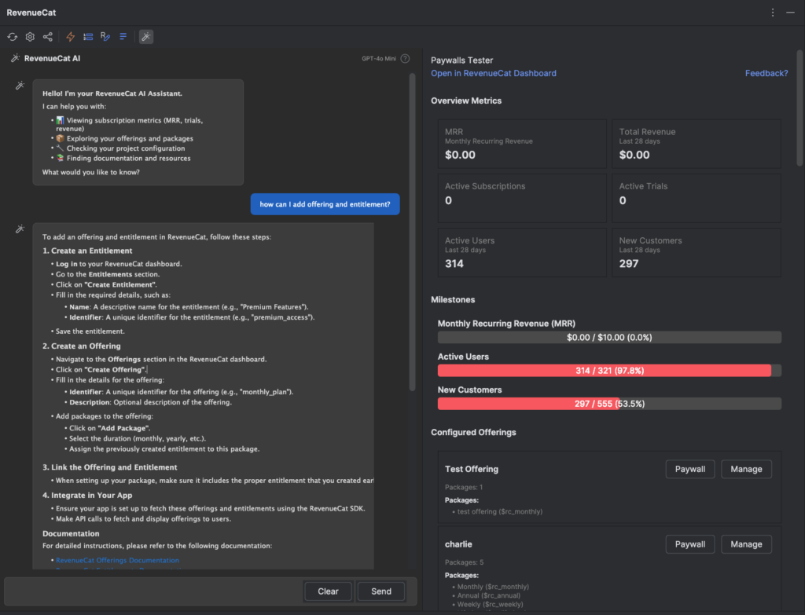
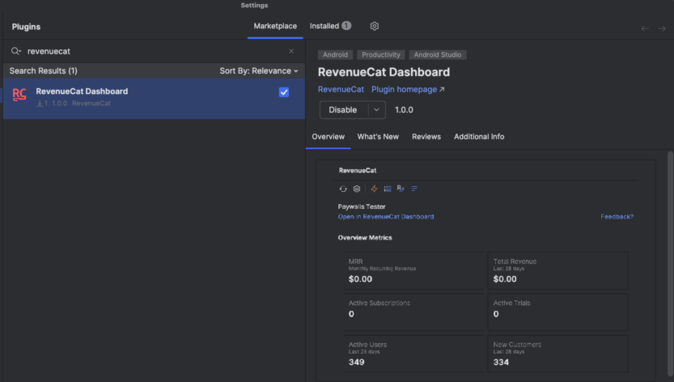
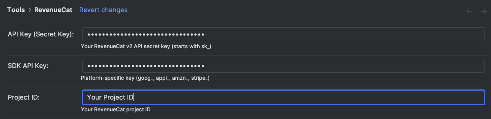
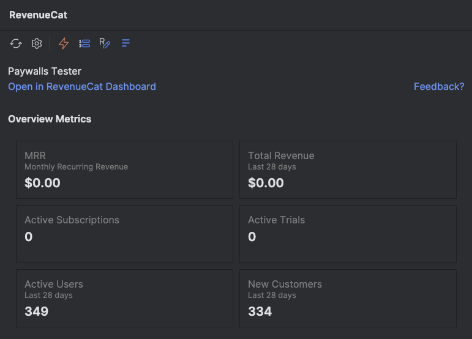
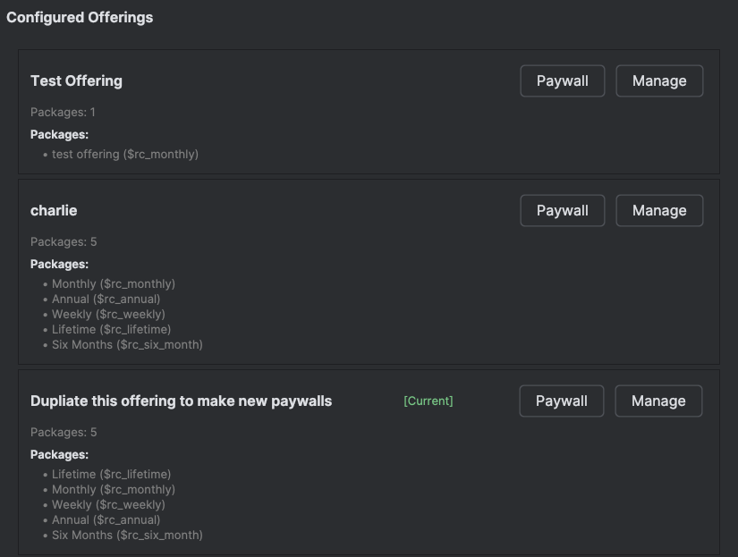
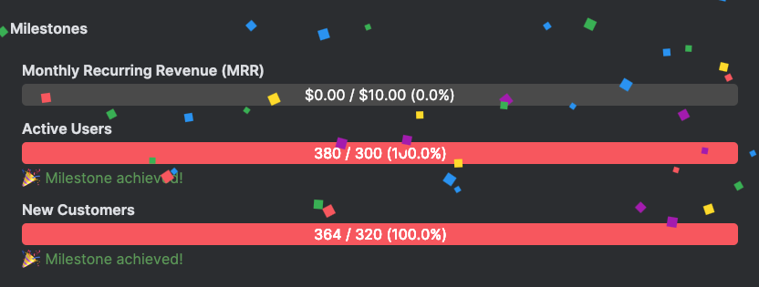
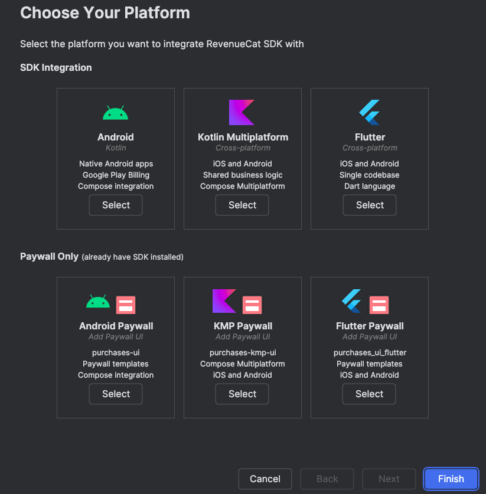
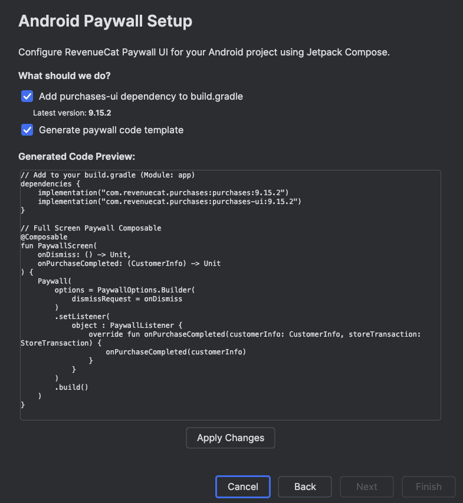
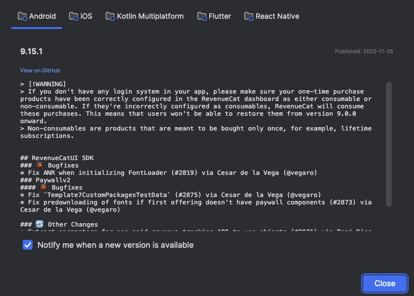
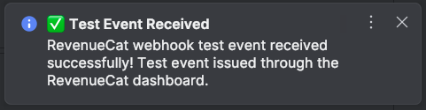

author: Jaewoong Eum
summary: RevenueCat IntelliJ Plugin - Manage subscriptions directly from your IDE
id: codelab-intellij-plugin
categories: codelab,markdown
environments: Web
status: Published
feedback link: https://github.com/revenuecat/codelab/issues/new
analytics_ga4_account: G-MMFEH1TP0C

# RevenueCat in Your IntelliJ IDE

## Overview
Duration: 0:02:00

Welcome to the [RevenueCat](https://www.revenuecat.com/) IntelliJ Plugin Codelab!

The RevenueCat IntelliJ Plugin brings subscription metrics, SDK tools, and webhook notifications directly into JetBrains IDEs like Android Studio and IntelliJ IDEA. No more context switching between your code and the RevenueCat dashboard—everything you need is right where you work.

In this codelab, you'll learn how to install and configure the plugin, monitor your subscription metrics in real-time, browse your offerings and packages, track business milestones, set up SDK integration with the built-in wizard, receive webhook notifications, and configure the AI Assistant for intelligent subscription queries.

## Install the Plugin
Duration: 0:02:00

The RevenueCat Dashboard plugin is available on the [JetBrains Marketplace](https://plugins.jetbrains.com/plugin/29265-revenuecat-dashboard) for easy installation.

1. Open **Settings/Preferences** (⌘, on macOS or Ctrl+Alt+S on Windows/Linux)
2. Navigate to **Plugins**
3. Click the **Marketplace** tab
4. Search for **"RevenueCat Dashboard"**
5. Click **Install**
6. Restart your IDE

Positive
: The plugin supports IntelliJ IDEA 2023.1 or later and Android Studio Hedgehog or newer.

## Configure Your API Keys
Duration: 0:03:00

After installation, you'll need to configure your RevenueCat credentials to connect the plugin to your dashboard. Open **Settings/Preferences**, navigate to **Tools > RevenueCat**, and enter your credentials.

### API Key (Secret Key)

The API Secret Key is your RevenueCat v2 API secret key, which starts with `sk_`. This key allows the plugin to securely communicate with the RevenueCat API to fetch your subscription data. You can find this key in your RevenueCat dashboard under **Project Settings > API Keys**.

Negative
: Keep your API Secret Key secure. Never commit it to version control or share it publicly.

### SDK API Key

The SDK API Key is your platform-specific public key—the same key you use to initialize the RevenueCat SDK in your app. Depending on your platform, this key will have a different prefix: `goog_` for Google Play, `appl_` for App Store, `amzn_` for Amazon, or `stripe_` for Stripe. This key helps the plugin understand which platform context you're working with.

### Project ID

Your RevenueCat project ID identifies your specific project and can be found in your dashboard URL or project settings. Once you've entered all three credentials, click **Apply** to save your settings. The plugin will validate your credentials and establish a connection to your RevenueCat dashboard.

## View Metrics Dashboard
Duration: 0:03:00

With your credentials configured, you can now access the RevenueCat tool window to monitor your subscription business in real-time. Open the tool window from **View > Tool Windows > RevenueCat** to see your metrics at a glance.

### Overview Metrics

The dashboard provides a comprehensive snapshot of your subscription health. At the top, you'll see your **MRR (Monthly Recurring Revenue)**, which represents your normalized monthly revenue from all active subscriptions—this is the heartbeat of your subscription business.

Next to MRR, the **Total Revenue** metric shows how much revenue you've generated in the last 28 days, giving you a sense of recent performance. The **Active Subscriptions** count tells you how many customers currently have an active subscription, while **Active Trials** shows users who are trying your product before committing.

The **Active Users** metric tracks total engagement over the last 28 days, and **New Customers** highlights your acquisition success by showing how many new paying customers you've gained recently. Together, these metrics give you a complete picture of your subscription business without ever leaving your IDE.

Positive
: Click **Open in RevenueCat Dashboard** to jump directly to your full dashboard in the browser for deeper analysis and historical charts.

## Browse Offerings and Packages
Duration: 0:03:00

When you're implementing purchase flows or paywalls, you need quick access to your configured offerings and packages. The plugin's Offerings tab lets you explore your entire product catalog without switching to the browser.

Click on the **Offerings** tab in the RevenueCat tool window to see all your configured offerings:

### Understanding Your Offerings

Each offering represents a collection of packages that you present to users at a specific point in your app. The plugin displays the offering name along with its current status—look for the **[Current]** badge to identify your default offering that users see when you don't specify one explicitly.

Within each offering, you'll see all the packages it contains. Each package shows its identifier (like `$rc_monthly`, `$rc_annual`, or `$rc_lifetime`), which is exactly what you need when writing purchase code. This eliminates the guesswork and copy-paste errors that can happen when you're switching between your code and the dashboard.

### Quick Actions

Each offering has two action buttons. The **Paywall** button lets you preview the paywall associated with this offering, so you can see exactly what your users will experience. The **Manage** button takes you directly to that offering in your RevenueCat dashboard, where you can edit packages, adjust pricing, or modify the paywall design.

## Track Milestones
Duration: 0:02:00

Building a subscription business is a journey, and celebrating milestones along the way keeps you motivated. RevenueCat tracks your progress toward key business goals, and the plugin brings these achievements directly into your IDE.

### Celebrating Your Progress

The Milestones view shows your progress across three key dimensions of your subscription business. First, **Monthly Recurring Revenue (MRR)** milestones track your journey toward revenue goals—watching this bar fill up as your business grows is incredibly satisfying.

Second, **Active Users** milestones help you monitor your user growth. As more people engage with your app, you'll hit milestones that reflect your expanding reach. Third, **New Customers** milestones celebrate your acquisition success, marking the moments when your customer base reaches new heights.

When you hit a milestone, the plugin shows a celebratory notification complete with confetti! It's a small touch, but seeing these achievements pop up while you're coding creates a tangible connection between your development work and your business success.

## SDK Integration Wizard
Duration: 0:04:00

One of the plugin's most powerful features is the SDK Integration Wizard. Instead of manually adding dependencies and writing boilerplate code, the wizard guides you through the entire setup process with just a few clicks.

### Choose Your Platform

Access the wizard from the RevenueCat menu and you'll see options for different platforms and use cases:

For **full SDK integration**, you can choose Android (Kotlin) for native Android apps with Google Play Billing and Compose integration, Kotlin Multiplatform for cross-platform iOS and Android apps with shared business logic, or Flutter for cross-platform development with Dart.

If you **already have the SDK installed** and just want to add paywall functionality, separate options are available for Android Paywall, KMP Paywall, and Flutter Paywall. These streamlined paths add only the paywall UI components without reinstalling the core SDK.

### Automatic Setup

After selecting your platform, the wizard takes care of the tedious setup work:

The wizard automatically adds the required dependencies to your `build.gradle` or `pubspec.yaml` file, using the latest stable version. It then generates code templates for paywall implementation, including the composable functions and listeners you need to handle purchases properly.

Before applying any changes, the wizard shows you a preview of the generated code. You can review exactly what will be added to your project, make sure it fits your architecture, and then apply the changes with confidence. The generated code follows RevenueCat best practices, including proper error handling and purchase completion callbacks.

## SDK Release Notifications
Duration: 0:02:00

Keeping your SDK up-to-date is important for accessing new features, bug fixes, and security patches. The plugin monitors RevenueCat SDK releases across all platforms and notifies you when updates are available.

### Stay Current Across All Platforms

The release viewer provides a unified view of SDK updates for Android, iOS, Kotlin Multiplatform, Flutter, and React Native. You can switch between platforms using the tabs at the top to see what's new in each ecosystem.

For each release, you'll see the version number, publish date, and a detailed breakdown of changes. Bug fixes are clearly marked so you can assess whether they affect your implementation. Breaking changes and warnings are highlighted prominently, helping you prepare for any migration work. The viewer also shows other changes and enhancements that might benefit your app.

Each release includes a **View on GitHub** link that takes you directly to the full release notes, where you can dive deeper into specific changes or review the commit history.

Enable **Notify me when a new version is available** to receive automatic desktop notifications when any RevenueCat SDK is updated. This way, you'll always know when it's time to upgrade.

## Webhook Notifications
Duration: 0:02:00

During development and testing, knowing when webhook events fire is crucial for debugging your server integration. The plugin provides real-time desktop notifications for RevenueCat webhook events, so you can see immediately when something happens.

### Real-Time Event Monitoring

When a webhook event fires—whether it's a test event you triggered or a real purchase from the sandbox—you'll see a desktop notification appear instantly. The notification shows the event type, success or failure status, and relevant details about what happened.

This is particularly valuable during development when you're testing purchase flows. Instead of checking server logs or refreshing the RevenueCat dashboard, you get immediate feedback right on your desktop. You can verify that your webhook endpoint is receiving events correctly, confirm that test purchases are being processed, and catch any issues before they reach production.

Positive
: Use the **Send Test Webhook** button in your RevenueCat dashboard to verify your webhook notifications are working correctly. You should see a notification appear within seconds.

## AI Assistant (Optional)
Duration: 0:04:00

The RevenueCat IntelliJ plugin includes an AI Assistant that transforms how you interact with your subscription data. Instead of navigating through dashboards and documentation, you can simply ask questions in natural language and get immediate answers.

### Enable AI Assistant

To get started with the AI Assistant, open **Settings/Preferences** and navigate to **Tools > RevenueCat > AI Settings**. Enable the **AI Assistant** toggle, then choose your preferred AI provider. The plugin supports OpenAI (GPT-4o and GPT-4o Mini), Anthropic (Claude 3.5 Sonnet and Claude 3 Haiku), and Google (Gemini 2.5 Flash and Gemini 2.5 Pro). Each provider offers different strengths—GPT-4o and Claude Sonnet excel at complex reasoning, while GPT-4o Mini and Gemini Flash provide faster responses for simpler queries.

After selecting your provider, enter your API key. The key is stored securely in IntelliJ's credential storage on your local computer and is never sent to RevenueCat.

Negative
: Your AI API key is stored securely in IntelliJ's credential storage on your local computer and is never sent to RevenueCat.

### Intelligent Subscription Queries

Once configured, the AI Assistant becomes your personal subscription expert. You can ask about your metrics—"What's my current MRR?" or "How many active trials do I have?"—and get instant answers based on your actual data.

Need to check your configuration? Ask "What offerings do I have configured?" and the assistant will list all your offerings with their packages and identifiers. Wondering about trends? Try "Show me my revenue growth" or "What's my trial conversion rate?" for insights into your business performance.

The assistant also helps with implementation questions. Ask "How do I fetch offerings on Android using Kotlin?" and you'll get code examples tailored to your project. It combines your RevenueCat data with documentation knowledge to provide contextual, actionable answers—all without leaving your IDE.

## Conclusion
Duration: 0:01:00

Congratulations! You've learned how to use the RevenueCat IntelliJ Plugin to manage your subscription business directly from your IDE. From monitoring metrics and browsing offerings to setting up SDK integration and receiving webhook notifications, you now have powerful tools at your fingertips.

The plugin eliminates context switching between your code and the RevenueCat dashboard, helping you stay in your flow state while keeping a pulse on your subscription business. Whether you're debugging a purchase flow, checking your latest metrics, or setting up a new project, everything you need is just a click away.

### Next Steps

To continue your RevenueCat journey, explore the [RevenueCat Documentation](https://www.revenuecat.com/docs/) for comprehensive guides on all features. If you're building an Android app, check out the [Android SDK Codelab](https://revenuecat.github.io/codelab/android/codelab-2-android-sdk/) to implement purchases and paywalls step by step.

Now go build something amazing—and watch those metrics grow!
