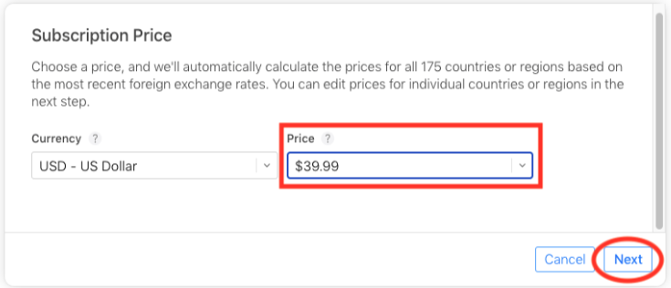
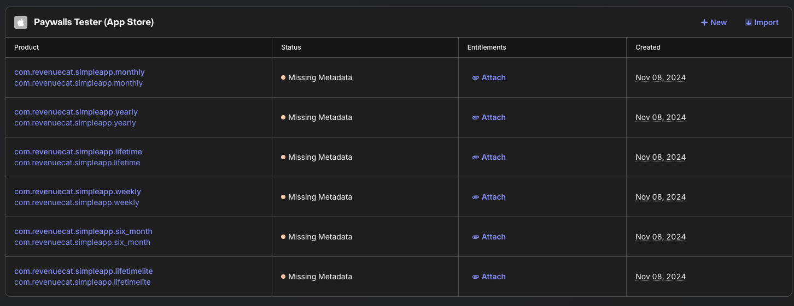

author: Jaewoong Eum
summary: RevenueCat App Store Integration
id: app-store
categories: codelab,markdown
environments: Web
status: Published
feedback link: https://github.com/revenuecat/codelab/issues/new
analytics_ga4_account: G-MMFEH1TP0C

# RevenueCat App Store Integration

## RevenueCat App Store Integration Overview
Duration: 0:03:00

Welcome to [RevenueCat](https://www.revenuecat.com/)'s App Store Integration Codelab!

In this codelab, you’ll learn how to:

*   Properly configure products on App Store Connect.
*   Set up the RevenueCat dashboard and connect it to your App Store products.
*   Understanding Product, Offering, Package, and Entitlement.
*   Create paywalls using the [Paywall Editor](https://www.revenuecat.com/docs/tools/paywalls/creating-paywalls#using-the-editor).

By the end of this codelab, you’ll be able to set up everything about App Store Connect and the RevenueCat dashboard before implementing in-app purchases and paywalls seamlessly in your iOS app, with all the necessary setup completed.

### Why RevenueCat?

The world’s leading apps rely on RevenueCat to power in-app purchases, subscriptions, and paywalls, manage customer data, and grow revenue across iOS, Android, and the web. Handling over $8B in annual in-app purchases, RevenueCat is trusted by top companies like OpenAI (ChatGPT), Notion, Buffer, and Goodnotes.

#### Why do so many developers choose RevenueCat?

RevenueCat simplifies cross-platform in-app purchases while providing a unified source of truth for analytics. It helps you better understand lifetime value (LTV), revenue trends, and user behavior—enabling smarter monetization and faster growth. Key benefits include:

*   **Unified User Identity**: Reliably link purchases to your own user IDs, solving the disconnect between app-level and store-level accounts.
*   **Streamlined Subscription Management**: Abstracts platform-specific limitations, offering consistent subscription behavior even when direct control is limited (e.g., on iOS).
*   **Cross-Platform Analytics**: Get standardized, real-time insights that are clearer and more actionable than the delayed data from Apple and Google consoles.
*   **Accurate Pricing Insights**: Understand exactly what users paid, across all locales and stores, even when native frameworks fall short.

With RevenueCat, monetizing your app becomes simpler, smarter, and more scalable.

## Set up App Store Connect Products
Duration: 0:08:00

First, log in to [App Store Connect](https://appstoreconnect.apple.com/), which is Apple's central hub for managing your apps. This guide assumes you have an app already set up and are ready to add in-app purchases.

### 📘 Important: Complete Your Agreements First!

Before you can create or test any in-app purchases, you must have your business agreements in order.

1.  **Sign the Paid Applications Agreement**: Navigate to the **Agreements, Tax, and Banking** section. Ensure the 'Paid Applications' agreement shows an 'Active' status. You will not be able to test purchases until the latest version is signed.
2.  **Complete Tax and Banking Info**: In the same section, go through the "Tax" and "Banking" tabs. You must link a bank account and have its status be "Clear" before you can proceed.

Signing all agreements is required to continue.

### Create an In-App Purchase

In App Store Connect, navigate to **My Apps** and select your application. In the sidebar, select **Subscriptions** under the "Features" section.

If you're creating a one-time purchase (like a non-consumable), select **In-App Purchases** instead. The steps are very similar.

### 1. Create a Subscription Group

Subscription Groups organize your products so users can easily switch between them (e.g., upgrading from a monthly to an annual plan). If you don't have one yet, you'll be prompted to create one.

Click the **'+'** symbol to create a Subscription Group. You’ll need to provide a **Reference Name**. This is not shown to users, so use something descriptive for your own reference (e.g., "Pro Tier Subscriptions").

### 2. Add a New Subscription Product

After creating your Subscription Group, click the **'+'** symbol next to its name to add a new subscription product.

You'll be asked to provide a **Reference Name** and a **Product ID**.

*   **Reference Name:** This is for your internal use in App Store Connect and reports. It won't be displayed to users. Use a human-readable name like "Pro Plan - Annual".
*   **Product ID:** This is a crucial, unique identifier for your product. It can never be used again, even if you delete the product. We highly recommend a consistent naming scheme.

> **📘 Pro Tip: Product ID Naming Convention**
> A good format is "<app>_<price>_<duration>_<intro>".
> For example, a $39.99/year subscription with a 1-week free trial could be: `rc_3999_1y_1wfree`. This makes it easy to identify products at a glance.

### 3. Set Subscription Duration and Price

Once the product is created, set the subscription **Duration** from the dropdown menu (e.g., '1 Year').

Next, in the **Subscription Prices** section, click the **'+'** icon to add a price. Choose your primary currency and price, and Apple will automatically calculate prices for all other regions.

At the last step, remember to **Save** your changes.

### 4. Add Introductory Offers (Optional)

To add a free trial or introductory price, click the **Introductory Offers** tab. Click the **'+'** icon to configure it. You can set the countries, duration, and type of offer (e.g., Free, Pay as you go). For a simple free trial, select **Free** and choose the duration.

At the last step, remember to **Save** your changes.

### 5. Add Localization and Reviewer Information

Finally, you need to provide the customer-facing details and information for Apple's review team.

* **Localization:** Under **App Store Information**, add a localization. Provide a **Subscription Display Name** and **Description**. This is what users will see.
* **Reviewer Information:** You must upload a **Screenshot** of your paywall (a placeholder is fine during development) and can add optional **Review Notes**. Your app cannot be submitted for review without this screenshot.

> **📘 Pro Tip:** For all products that unlock the same level of access (e.g., monthly and annual "Pro" plans), use the exact same **Subscription Display Name**. This creates a cleaner and less confusing experience for users in the App Store.

Once you’ve finished setting up your products on App Store Connect, you’re all set!

## Connect App Store to RevenueCat
Duration: 0:05:00

Next, set up your [RevenueCat account](https://app.revenuecat.com/signup?utm_medium=organic&utm_source=codelab&utm_campaign=advocate). All you need is an email address.

Connecting the App Store to RevenueCat is simpler than Google Play and relies on an **App-Specific Shared Secret**. This secret allows RevenueCat to securely validate receipts with Apple's servers.

### 1. Generate an App-Specific Shared Secret (StoreKit 1 Only)

> 📘 *Note*: The app-specific shared secret is used with StoreKit 1 but is now deprecated by Apple. New apps are recommended to use StoreKit 2 and configure the in-app purchase key instead. This field is required to validate transactions if your app is targeting iOS 15 or below, or is configured to use StoreKit 1.

1.  In **App Store Connect**, navigate to **My Apps** and select your app.
2.  In the sidebar, go to **App Information** under the "General" section.
3.  Scroll down to find the **App-Specific Shared Secret** and click **Manage**.
4.  Click **Generate** to create a new secret. Copy it to your clipboard.

### 2. Create App Configs and Add the Secrets to RevenueCat

1.  In your [RevenueCat dashboard](https://app.revenuecat.com/), go to your **Apps & providers** and select your iOS configuration under the "App configuration" section. If you haven't created anything about app configs for App Store, you should click the **+ Add app config** on the right corder, and put your iOS app configurations.
2.  Paste the **App-Specific Shared Secret** you just generated into the corresponding field. (StoreKit 1 Only)
3.  Click **Save Changes**.

That's it! RevenueCat can now communicate with the App Store for your app.

Phew, Congrats! You made it through the tricky part 🎉

## Product, Offering, Package, and Entitlement
Duration: 0:6:00

At this point, most of the complex setup is behind you. Now it’s time to get familiar with four essential concepts in RevenueCat that you'll need to understand before configuring your monetization strategy: **Product**, **Offering**, **Package**, and **Entitlement**.

Each of these plays a unique role in how you define, present, and manage your in-app purchases across platforms.

### 🧩 Product

A Product is an individual in-app purchase item created and managed directly in the store platforms such as the Google Play, Apple App Store, or on the web. This is the base unit of monetization—think monthly subscriptions, lifetime access, or one-time purchases. Each product has its own unique identifier, price, and duration settings defined by the store.

> Example: A monthly subscription product like `rc_1499_1m` configured in App Store Connect.

### 🎯 Offering

An Offering is a collection of products grouped together to be presented as a paywall experience in your app. Offerings are configured in the RevenueCat dashboard and give you flexibility in managing A/B testing, price experiments, and regional or user-segmented paywalls, all without requiring app updates.

> Example: An offering named `default` might contain several packages like a monthly, annual, and lifetime option shown to users.

### 📦 Package

A Package acts as a wrapper for equivalent products across different platforms (e.g., iOS, Android, Web). It allows you to present one pricing option (like a monthly subscription) consistently across platforms, while linking it to each store's specific product ID.

Each package has a unique identifier (e.g., `monthly`, `annual`) within an offering, and helps RevenueCat resolve the correct product based on the user’s platform.

> Example: A `monthly` package might map to `com.app.pro_monthly_ios` on iOS and `com.app.pro_monthly_android` on Android.

### 🏷️ Entitlement

An Entitlement defines what the user gains access to after a successful purchase. It represents the features or content unlocked, and abstracts away the underlying product or package identifiers. Entitlements allow you to manage user access logic (e.g., "has premium access") without hardcoding product IDs into your app.

They are also central to how RevenueCat tracks and restores purchases across devices and platforms.

> Example: An entitlement called `premium` might be granted to users who purchase any product associated with that access level, such as monthly or yearly subscriptions.

### Cheat Sheet

Understanding how these four elements work together will make it easier to manage cross-platform subscriptions, experiment with pricing strategies, and deliver a seamless in-app purchase experience.

For easier understanding, you can refer to the visual diagram in the RevenueCat In-App Purchases Cheat Sheet below:

## Import Store Products
Duration: 0:3:00

To get started, go to the **RevenueCat dashboard**, navigate to your project, and open the **Products** tab under **Project Catelog**.

Click the **➕ New** button in the top right corner, then select **Import Products** from the dropdown menu. RevenueCat will automatically fetch and display a list of available in-app products from your connected store accounts (such as the App Store or Google Play).

Once your products have been imported, you'll see that the in-app purchase items have been successfully added to your RevenueCat project.

## Create Entitlements
Duration: 0:5:00

Now that you've imported or created products, it's time to set up **entitlements**.
As you’ve learned, entitlements define what a user gains access to after a successful purchase.

Typically, you’ll want to create one or more entitlements based on your **feature access tiers** (e.g., `"pro_access"`). These entitlements let you control access to gated features or content within your app.

To create a new entitlement:

1. Go to the **Product Catalog** in the left menu of your project dashboard.
2. Click the **Entitlements** tab.
3. Select **➕ New Entitlement**.

You'll be prompted to enter a **unique identifier** for your entitlement (e.g., `"pro"`), which you’ll later reference in your app to check a user’s access level.

### Attaching Products to Entitlements

Now it’s time to **attach products to entitlements**. This ensures that when a user purchases a product, they are granted the corresponding entitlement.

To attach a product to an entitlement:

1. Open the **Entitlements** tab in the RevenueCat dashboard.
2. Click on the entitlement you want to configure.
3. Click the **Attach** button.
4. If you’ve already added your products, you’ll see them in a list—just select the one you want to link.

When a product attached to an entitlement is purchased, the **entitlement becomes active for the duration of that product**.

If you don't plan to implement [Paywalls](https://www.revenuecat.com/docs/tools/paywalls) in your app, you can skip ahead to the **Conclusion** section. Otherwise, continue to the next step.

## Create Offerings (Optional)
Duration: 0:7:00

If you want to introduce [Paywalls](https://www.revenuecat.com/docs/tools/paywalls) in your app, the first step is to create Offerings. An Offering represents a set of products that are presented to users on your paywall.

### Adding Packages

A Package serves as a wrapper for equivalent products across different platforms. This provides a single source of truth for your products.

To create a package, navigate to your newly created **Offering**, then click the **Edit** button to configure the details, and then you can add packages by clicking the **+ New Package** in the **Packages** section.

From there:

1.  **Choose an Identifier** from the dropdown that best represents the package duration (e.g., monthly, annual).
2.  **Add a description** to help clarify the purpose of the package.
3.  **Attach the relevant products** that match the chosen duration (e.g., your annual iOS product).
4.  Click **Save** to create the package.

Once you've added all the Packages to your Offering, you’ll see the results displayed as shown below:

Alright, time to create some awesome Paywalls!

## Create Paywalls (Optional)
Duration: 0:7:00

A paywall is a screen that encourages users to purchase your products. RevenueCat’s paywall system is built on a server-driven UI, allowing you to update layouts instantly using the [Paywall Editor](https://www.revenuecat.com/docs/tools/paywalls-v2/creating-paywalls#using-the-editor) without needing to release a new app version.

This allows your team to focus on A/B testing, refining offerings, and optimizing messaging to boost subscriptions, all without the delays of app updates.

### Building Paywalls

To start building, go to the **Paywalls** page for your project and click **➕ New Paywall**.

Next, choose a pre-built template as a starting point or begin from scratch.

In the editor, set a name for your paywall and select an identifier, which will automatically link the paywall to the corresponding Offering. Customize your content, colors, and images.

Once you’ve finished, click “Save to draft”. When you're ready, click “Publish changes” to make your paywall live.

🎉 Yay! You’ve completed all the configuration steps for setting up App Store products and the RevenueCat dashboard!

## Conclusion

In this codelab, you’ve learned how to configure App Store Connect products, connect your account to the RevenueCat dashboard, and set up products, offerings, entitlements, and paywalls. With everything now configured, you're ready to integrate the RevenueCat SDK into your project!

You can also learn more about using the RevenueCat SDK with the resources below:

- [Codelab: iOS In-App Purchases & Paywalls with SwiftUI](https://revenuecat.github.io/codelab/ios/ios/index.html#0) — your next step toward a fully functional monetization flow for your iOS project.
- [Product Tutorials](https://www.revenuecat.com/tutorials/): Video tutorials to help you get started and get the most out of RevenueCat.