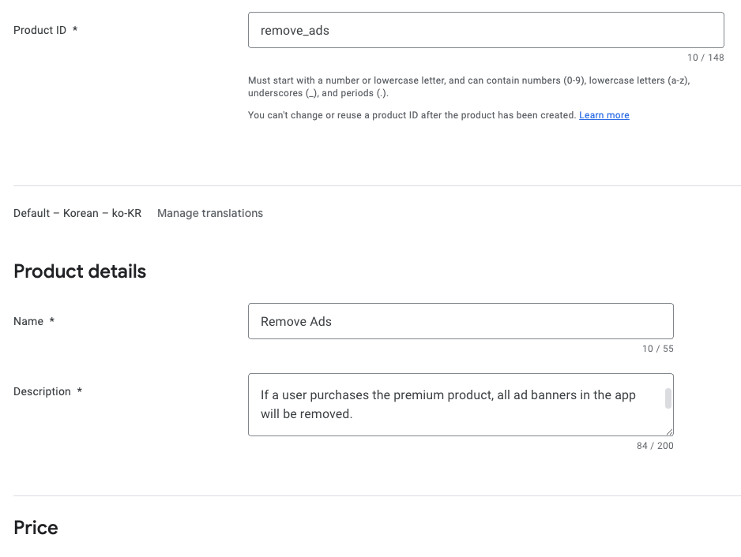
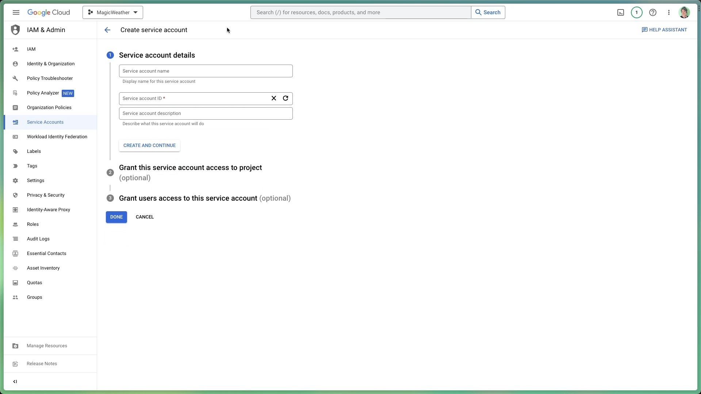
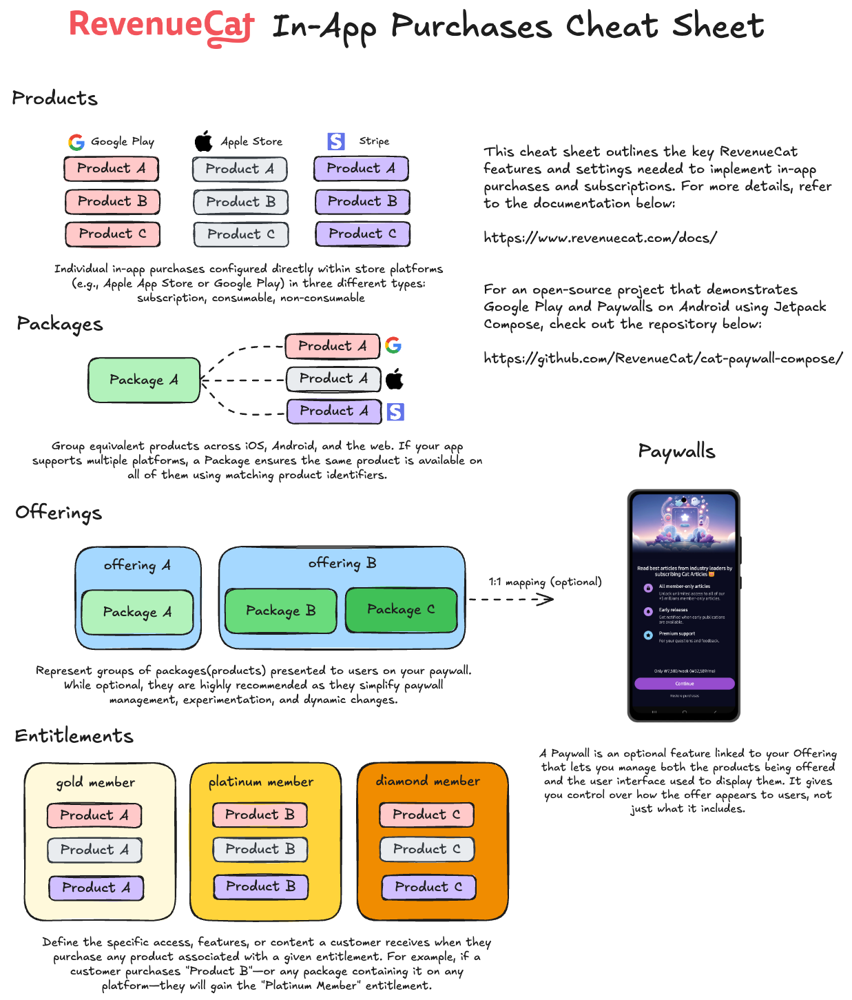
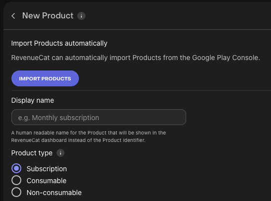
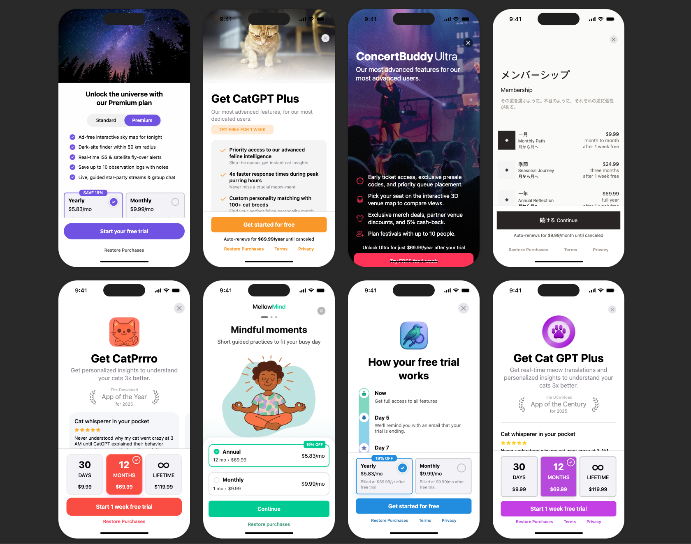
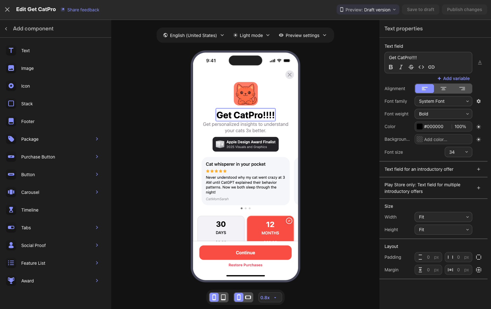

author: Jaewoong Eum
summary: RevenueCat Google Play Integration
id: codelab-1-google-play-integration
categories: codelab,markdown
environments: Web
status: Published
feedback link: https://github.com/revenuecat/codelab/issues/new
analytics_ga4_account: G-0MLNVKXFGB

# RevenueCat Google Play Integration

## RevenueCat Google Play Integration Overview
Duration: 0:03:00

Welcome to [RevenueCat](https://www.revenuecat.com/)'s Google Play Integration Codelab!

In this codelab, you’ll learn how to:

* Properly configure products on Google Play.
* Set up the RevenueCat dashboard and connect it to your Google Play products.
* Understanding Product, Offering, Package, and Entitlement.
* Create paywalls using the [Paywall Editor](https://www.revenuecat.com/docs/tools/paywalls/creating-paywalls#using-the-editor).

By the end of this codelab, you’ll be able to set up everything about Google Play and RevenueCat dashboard before implementing in-app purchases and paywalls seamlessly in your Android app, with all the necessary setup completed.

### Why RevenueCat?

The world’s leading apps rely on RevenueCat to power in-app purchases, subscriptions, and paywalls, manage customer data, and grow revenue across iOS, Android, and the web. Handling over $8B in annual in-app purchases, RevenueCat is trusted by top companies like OpenAI (ChatGPT), Notion, Buffer, and Goodnotes.

#### Why do so many developers choose RevenueCat?

RevenueCat simplifies cross-platform in-app purchases while providing a unified source of truth for analytics. It helps you better understand lifetime value (LTV), revenue trends, and user behavior—enabling smarter monetization and faster growth. Key benefits include:

* **Unified User Identity**: Reliably link purchases to your own user IDs, solving the disconnect between app-level and store-level accounts.
* **Streamlined Subscription Management**: Abstracts platform-specific limitations, offering consistent subscription behavior even when direct control is limited (e.g., on iOS).
* **Cross-Platform Analytics**: Get standardized, real-time insights that are clearer and more actionable than the delayed data from Apple and Google consoles.
* **Accurate Pricing Insights**: Understand exactly what users paid, across all locales and stores, even when native frameworks fall short.

With RevenueCat, monetizing your app becomes simpler, smarter, and more scalable.


## Set up Google Play Products
Duration: 0:05:00

First, log in to the [Google Play Console](https://play.google.com/console), select your application, then navigate to **Monetize with Play > Products** in the sidebar, and click on **In-app products** or **Subscriptions**, as shown in the image below.


Basically, there are two types of products you can create on Google Play: **In-app products** and **Subscriptions**.

### In-app products

These are one-time purchases that unlock features or content permanently. Examples include removing ads, unlocking a premium feature, or purchasing in-game currency.



When you click on **In-app products** in the sidebar, you'll see the screen shown above, where you can create a new in-app product that your users will be able to purchase.

### Subscriptions

These provide access to content or features for a recurring fee—either monthly, yearly, or custom periods. They're ideal for services like streaming content, premium app access, or regularly updated features.


When you create your subscription product, you can further customize it by adding subscription benefits, configuring a base plan, setting up offers (such as free trials or introductory pricing), and ultimately activating the product.


Once you’ve finished setting up your products on Google Play, you’re all set! If you’d like to dive deeper into creating in-app products or subscriptions, crafting reliable product IDs, setting up base plans and offers, or adding non-consumable items, check out the [Google Play Product Setup](https://www.revenuecat.com/docs/getting-started/entitlements/android-products?utm_medium=organic&utm_source=codelab&utm_campaign=advocate) guide for detailed instructions and best practices.

## Connect Google Play to RevenueCat
Duration: 0:15:00

Next, you should set up your [RevenueCat account](https://app.revenuecat.com/signup?utm_medium=organic&utm_source=codelab&utm_campaign=advocate) for managing the products, monetization, statistics, and more. All you need is just an email address.

After creating your account on RevenueCat, configure a set of [Google Play Store service credentials](https://www.revenuecat.com/docs/service-credentials/creating-play-service-credentials?utm_medium=organic&utm_source=github&utm_campaign=advocate) by following the instructions provided in the Google Play Store service credentials guide. 

This setup enables RevenueCat to integrate with your Google Play products, allowing you to seamlessly import store products into the RevenueCat dashboard, track purchase activity, analyze LTV reports, get user purchases notifications, and develop growth strategies using real-time data insights.

To get started, follow the steps below:

### 1. Enable the Google Developer and Reporting API

To activate both the Google Play Developer API and the Developer Reporting API in your Google Cloud project, follow these steps:

1. Open the [Google Cloud Console](https://console.developers.google.com/).
2. Choose your existing project from the dropdown or start a new one.
3. Visit the pages for the [Google Play Android Developer API](https://console.cloud.google.com/apis/library/androidpublisher.googleapis.com) and the [Google Play Developer Reporting API](https://console.cloud.google.com/apis/library/playdeveloperreporting.googleapis.com).
4. Click the **Enable** button on each page (it will display as **Manage** if already active).


Once the APIs are enabled, you’ll land on your project’s API dashboard. If no credentials are configured yet, you’ll be prompted to create them. Be sure to specify that the credentials are for use with the [Google Play Android Developer API](https://console.cloud.google.com/apis/library/androidpublisher.googleapis.com). This step should be completed by the project owner or by a team member who has the proper API access rights granted from the Google Play Console.

### 2. Create a Service Account

Head over to the [Service Accounts](https://console.cloud.google.com/iam-admin/serviceaccounts) section in your [Google Cloud Console](https://console.cloud.google.com/), and make sure you’re working inside the correct project.

From there, you'll need to generate a service account that RevenueCat can use to interface with Google services. Click on **Create Service Account**, give it a meaningful name, and proceed by selecting **Create and continue**.

When prompted to assign roles, be sure to include the following:

* **Pub/Sub Editor** – Required for handling Google’s real-time server notifications.
* **Monitoring Viewer** – Grants visibility into queue metrics and performance.

> **Note**: If the search bar doesn’t return the roles, you can manually locate them under the **Pub/Sub** and **Monitoring** categories in the list.



Now it’s time to generate the private key file.

In the Service Accounts panel of your Google Cloud Console, find the service account you just created. Click the three-dot icon under the "Actions" column and choose **Manage Keys**.

From there, hit **Add Key**, then choose **Create new key**. When the dialog appears, be sure to pick the **JSON** format before proceeding. Download the file—this JSON key will be needed later on in the setup process.


### 3. Grant Financial Access to RevenueCat

Head over to the **Users and Permissions** section in your Google Play Console. Once there, click **Invite user** to add the service account email you created earlier (Step 2).

Next, under **App permissions**, make sure to select the specific app you want RevenueCat to access. Then scroll down to the **Account permissions** area—this is where you’ll grant the required access for everything to run smoothly.

Make sure the following permissions are checked:

* Read app details and access bulk report downloads
* Access financial data, order history, and cancellation feedback
* Manage subscriptions and customer orders

Once everything looks good, scroll to the bottom and click **Send invite**. After sending, you’ll be taken back to the Users and Permissions overview, where you should see your service account listed with active status once it’s accepted.


### 4. Register the Credentials JSON in RevenueCat

To wrap things up, head over to your [RevenueCat dashboard](https://app.revenuecat.com/signup?utm_medium=organic&utm_source=codelab&utm_campaign=advocate) and open your project settings. Locate the JSON credentials file you saved earlier (from Step 2), and either drag and drop it into the setup area or browse for it manually using the file picker.

Once uploaded, don’t forget to hit **Save** to apply the changes. RevenueCat will begin verifying your credentials, and **within roughly 36 hours**, you’ll be all set to start processing Google Play purchases through your integration.

You can verify your credentials by clicking the **“Validate Credentials”** button, as shown below:


A summary will appear, displaying the results of the validation and giving you insight into the current status of your Google credentials. If everything is set up correctly, you’ll see a **“Valid credentials”** message beneath your uploaded JSON file, along with a checklist of all the required permissions.


### 5. Upload your signed APK or Android App Bundle

Once you’ve completed the previous steps, there are a few final checks to make sure everything is wired up correctly:

1. Confirm that your signed APK or App Bundle has been successfully uploaded to the Google Play Console.
2. Ensure your release has gone through all required review and approval steps.
3. Verify that your app is available in either the **Closed** or **Open** testing track, and that you've added at least one tester account.
4. Double-check that your subscription products are marked as **Active** in the Play Console.
5. Lastly, make sure the **package name** you’re using in RevenueCat matches exactly—character for character—with the one registered in Google Play.

These final validations are essential to avoid setup issues and ensure RevenueCat can sync seamlessly with your Google Play data.

Phew, Congrats! You made it through the tricky part 🎉

## Product, Offering, Package, and Entitlement
Duration: 0:6:00

At this point, most of the complex setup is behind you. Now it’s time to get familiar with four essential concepts in RevenueCat that you'll need to understand before configuring your monetization strategy: **Product**, **Offering**, **Package**, and **Entitlement**.

Each of these plays a unique role in how you define, present, and manage your in-app purchases across platforms.

### 🧩 Product

A Product is an individual in-app purchase item created and managed directly in the store platforms such as the Google Play, Apple App Store, or on the web. This is the base unit of monetization—think monthly subscriptions, lifetime access, or one-time purchases. Each product has its own unique identifier, price, and duration settings defined by the store.

> Example: A monthly subscription product like `com.app.pro_monthly` configured in the Google Play.

### 🎯 Offering

An Offering is a collection of products grouped together to be presented as a paywall experience in your app. Offerings are configured in the RevenueCat dashboard and give you flexibility in managing A/B testing, price experiments, and regional or user-segmented paywalls, all without requiring app updates.

> Example: An offering named `default` might contain several packages like a monthly, annual, and lifetime option shown to users.

### 📦 Package

A Package acts as a wrapper for equivalent products across different platforms (e.g., iOS, Android, Web). It allows you to present one pricing option (like a monthly subscription) consistently across platforms, while linking it to each store's specific product ID.

Each package has a unique identifier (e.g., `monthly`, `annual`) within an offering, and helps RevenueCat resolve the correct product based on the user’s platform.

> Example: A `monthly` package might map to `com.app.pro_monthly_ios` on iOS and `com.app.pro_monthly_android` on Android.

### 🏷️ Entitlement

An Entitlement defines what the user gains access to after a successful purchase. It represents the features or content unlocked, and abstracts away the underlying product or package identifiers. Entitlements allow you to manage user access logic (e.g., "has premium access") without hardcoding product IDs into your app.

They are also central to how RevenueCat tracks and restores purchases across devices and platforms.

> Example: An entitlement called `premium` might be granted to users who purchase any product associated with that access level, such as monthly or yearly subscriptions.

### Cheat Sheet

Understanding how these four elements work together will make it easier to manage cross-platform subscriptions, experiment with pricing strategies, and deliver a seamless in-app purchase experience.

For easier understanding, you can refer to the visual diagram in the RevenueCat In-App Purchases Cheat Sheet below:



## Import Store Products
Duration: 0:3:00

To get started, go to the **RevenueCat dashboard**, navigate to your project, and open the **Products** tab under **Project Settings**.

Click the **➕ New** button in the top right corner, then select **Import Products** from the dropdown menu. RevenueCat will automatically fetch and display a list of available in-app products from your connected store accounts (such as the App Store or Google Play).



Once your products have been imported, you'll see that the in-app purchase items have been successfully added to your RevenueCat project.


## Create Entitlements
Duration: 0:5:00

Now that you've imported or created products, it's time to set up **entitlements**.
As you’ve learned, entitlements define what a user gains access to after a successful purchase. A "purchase" can refer to any type of in-app transaction—such as one-time purchases or subscriptions—that users make to access your service.

Typically, you’ll want to create one or more entitlements based on your **feature access tiers** (e.g., `"has_premium_access"`). These entitlements let you control access to gated features or content within your app.

To create a new entitlement:

1. Go to the **Product Catalog** in the left menu of your project dashboard.
2. Click the **Entitlements** tab.
3. Select **➕ New Entitlement**.


You'll be prompted to enter a **unique identifier** for your entitlement (e.g., `"pro"`), which you’ll later reference in your app to check a user’s access level.

Most apps use a single entitlement, but you can create multiple if needed.
For example, a **navigation app** might offer a subscription for full access (`"pro"`) and also sell one-time purchases to unlock specific map regions. In that case, you'd likely have one `"pro"` entitlement, along with additional entitlements for each region (e.g., `"map_north_america"`, `"map_europe"`).

### Attaching Products to Entitlements

Now it’s time to **attach products to entitlements**, which links your in-app purchases to the access they unlock. This setup ensures that when a user purchases a product, they are granted the corresponding entitlement—giving them access to specific features or content in your app.

For example, you can easily implement gated features using a simple `if` statement that checks whether the user has a given entitlement.

To attach a product to an entitlement:

1. Open the **Entitlements** tab in the RevenueCat dashboard.
2. Click on the entitlement you want to configure.
3. Click the **Attach** button.
4. If you’ve already added your products, you’ll see them in a list—just select the one you want to link.


When a product attached to an entitlement is purchased, the **entitlement becomes active for the duration of that product**.

* For **subscription products**, the entitlement remains active for the length of the subscription period.
* For **non-consumable** or **consumable** purchases (when attached to an entitlement), the entitlement typically unlocks the content **permanently**.

This mechanism allows you to manage feature access based on purchase type without having to handle complex logic in your app.

If you don't plan to implement [Paywalls](https://www.revenuecat.com/docs/tools/paywalls) in your app, you can skip ahead to the **Conclusion** section. Otherwise, continue to the next step to learn how to create Offerings.

## Create Offerings (Optional)
Duration: 0:7:00

If you want to introduce [Paywalls](https://www.revenuecat.com/docs/tools/paywalls) in your app, the first step is to create Offerings. 

An Offering represents a set of products that are presented to users on your paywall—essentially the options that are “offered” for purchase.

For example, you might offer your users the following choices:

* Subscribe to the **Pro plan** for **\$10/month**, or
* Get a better deal by subscribing **annually for \$80/year**.

Offerings allow you to group these products together and control how they're displayed and tested within your app.


When creating an Offering, you’ll need to add one or more Packages. Each Offering should include at least one Package that groups together equivalent products across platforms (e.g., iOS, Android, Web).

### Adding Packages

A Package serves as a wrapper for equivalent products across different platforms (e.g., iOS, Android, Web). This provides a single source of truth for your products across platforms. 

For example, if a user purchases a product on Android, they can still access the same entitlement on their iOS device, as long as they’re logged into the same account.

Here’s a refined version of your paragraph with clearer structure, improved grammar, and smoother phrasing:

To create a package, navigate to your newly created **Offering**, then click **+ Add Package** in the **Packages** section.

From there:

1. **Choose an Identifier** from the dropdown that best represents the package duration (e.g., monthly, annual).
2. If none of the predefined durations fit—such as in the case of **consumable purchases**—you can select a **custom identifier** instead.
3. **Add a description** to help clarify the purpose or contents of the package.
4. **Attach the relevant products** that match the chosen duration (e.g., monthly products across iOS and Android).
5. Click **Save** to create the package.


Once you've added all the Packages to your Offering, you’ll see the results displayed as shown below:


### The releationships between Offerings and Packages

So, an Offering can contain multiple Packages, allowing you to "offer" different options to users. This means you can present various choices—such as monthly, annual, or lifetime plans—all within a single Offering, as illustrated in the diagram below:

```
             Offering (e.g. "pro plan")
                    |
       --------------------------------
       |              |              |
   Package A      Package B      Package C
   ("monthly")    ("annual")    ("lifetime")
       |              |              |
 Product A1      Product B1      Product C1
 (iOS/Android)   (iOS/Android)   (iOS/Android)

```

Alright, time to create some awesome Paywalls!

## Create Paywalls (Optional)
Duration: 0:7:00

A paywall is a screen that restricts access to certain features and encourages users to subscribe or purchase your products. RevenueCat’s paywall system is built on a server-driven UI, allowing teams to update layouts without going through the traditional release cycle—such as modifying code, publishing to Google Play, waiting for review, and requiring users to update the app. Instead, layout changes can be made instantly using the [Paywall Editor](https://www.revenuecat.com/docs/tools/paywalls-v2/creating-paywalls#using-the-editor).


One of the biggest advantages of using the RevenueCat SDK for building paywalls is the ability to iterate quickly—your team can focus on A/B testing, refining offerings, experimenting with UI layouts, and optimizing messaging strategies to boost subscriptions, all without the delays of app updates, review processes, or waiting for users to install new versions. If you want to deep dive into the server-driven UI approach, you can read [Server-driven UI SDK on Android: how RevenueCat enables remote paywalls without app updates](https://www.revenuecat.com/blog/engineering/server-driven-android/).

### Building Paywalls

To start building paywalls using our new editor, go to the **Paywalls** page for your project and click **➕ New Paywall** in the callout section.


Next, you'll see a list of pre-built templates that you can use to quickly start building your own paywall screen. You can choose one of these templates as a starting point or begin from scratch if you prefer full customization.



Once you've selected a template or chosen to start from scratch, you'll be taken to the paywall editor screen shown below. From there, you'll need to set a name for your paywall and select an identifier, which will automatically link the paywall to the corresponding Offering.



Once you’ve finished editing your paywall, click “Save to draft” to save your changes. When you're ready to go live, click “Publish changes” to officially publish your first paywall.

🎉 Yay! You’ve completed all the configuration steps for setting up Google Play products and the RevenueCat dashboard—you’re now ready to integrate the RevenueCat SDK into your mobile project!

## Conclusion

In this codelab, you’ve learned how to configure Google Play products, connect your Google Play account to the RevenueCat dashboard, and set up products, offerings, entitlements, and paywalls. With everything now configured, you're ready to integrate the RevenueCat SDK into your project!

Up next:

- [Integrating RevenueCat Android SDK for In-App Purchases and Paywalls](https://revenuecat.github.io/codelab-internal-testing/android/codelab-2-android-sdk/index.html) — your next step toward a fully functional monetization flow.
- [Integrating RevenueCat Kotlin Multiplatform SDK for In-App Purchases and Paywalls](https://revenuecat.github.io/codelab/kmp/codelab-3-kmp-sdk/index.html#0)  — your next step toward a fully functional monetization flow for your KMP/CMP project.
- [Integrating RevenueCat Flutter SDK for In-App Purchases and Paywalls](https://revenuecat.github.io/codelab/flutter/codelab-4-flutter-sdk/index.html#0)  — your next step toward a fully functional monetization flow for your Flutter project.
- [Product Tutorials](https://www.revenuecat.com/tutorials/): Video tutorials to help you get started and get the most out of RevenueCat.