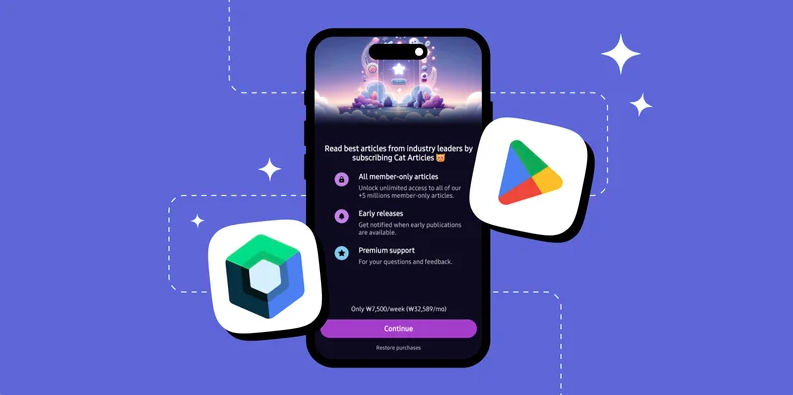

author: Jaewoong Eum
summary: RevenueCat iOS SDK Integration
id: ios
categories: codelab,markdown
environments: Web
status: Published
feedback link: https://github.com/revenuecat/codelab/issues/new
analytics_ga4_account: G-MMFEH1TP0C

# iOS In-App Purchases & Paywalls with SwiftUI

## iOS In-App Purchases & Paywalls Overview
Duration: 0:02:00

Welcome to [RevenueCat](https://www.revenuecat.com/)'s iOS SDK Codelab!

In this codelab, you will:

*   Integrate the **RevenueCat SDK** into your Xcode project.
*   Implement **in-app purchases** in your SwiftUI application.
*   Learn how to **distinguish between paying and non-paying users**.
*   Build a **paywall screen** using SwiftUI, driven by RevenueCat's server-side configuration.

By the end of this codelab, you’ll be able to successfully implement in-app purchases in your iOS app and display dynamic paywalls using RevenueCat's iOS SDK and SwiftUI.



## Import RevenueCat SDK
Duration: 0:05:00

First things first, before implementing in-app purchases, you’ll need to import the RevenueCat SDK into your project. The easiest way to do this is with the Swift Package Manager.

In Xcode, add the following to your `Podfile`:

```
pod 'RevenueCat'
pod 'RevenueCatUI'
```

Xcode will fetch the package. Make sure to add `RevenueCat` to your app's main target.

If you're also planning to implement our pre-built Paywalls, you can add the `RevenueCatUI` library at the same time.

Next, initialize the Purchases SDK in your App's `init()` method or in your `AppDelegate` using the code below:

```swift
import SwiftUI
import RevenueCat

@main
struct MyApp: App {
    init() {
        // Log all messages from the SDK
        Purchases.logLevel = .debug
        
        // Configure the SDK with your API key
        Purchases.configure(withAPIKey: <public_apple_api_key>, appUserID: <app_user_id>)
    }

    var body: some Scene {
        WindowGroup {
            ContentView()
        }
    }
}
```

*   **User Identification:** We haven't provided a specific `appUserID`, so RevenueCat will automatically generate and manage an anonymous ID for the user. If you want to use the restore features properly, please put a unique identifier that is provided by your backend.
*   **Transaction Finishing:** By default, the SDK automatically handles finishing transactions with the App Store, so you don't have to.

Yes! You’ve now completed 50% of the implementation.

## Validating Entitlements
Duration: 0:03:00

Now let’s move on to validating user entitlements.

An entitlement represents the level of access or features a user unlocks after making a purchase. This makes it useful for determining things like whether to show an ad banner or grant premium access.

You can easily check if a user has an active entitlement using Swift's modern `async/await` syntax:

```swift
import SwiftUI
import RevenueCat

struct ContentView: View {
    @State private var isSubscribed: Bool = false
    
    let ENTITLEMENT_ID = "premium" // Your entitlement identifier from the RevenueCat dashboard

    var body: some View {
        VStack {
            if isSubscribed {
                PremiumContent()
            } else {
                Text("This is the free content.")
                // You could show a banner or a paywall here
            }
        }
        .task {
            // Check for entitlement when the view appears
            await checkEntitlement()
        }
    }
    
    private func checkEntitlement() async {
        do {
            let customerInfo = try await Purchases.shared.customerInfo()
            // Check if the entitlement is active
            if customerInfo.entitlements[ENTITLEMENT_ID]?.isActive == true {
                self.isSubscribed = true
            } else {
                self.isSubscribed = false
            }
        } catch {
            print("Error fetching customer info: \(error)")
        }
    }
}
```

Once you’ve checked whether the user has a specific entitlement, you can decide how to proceed. In this SwiftUI example, we update a `@State` variable (`isSubscribed`) which causes the view to automatically re-render and show either the premium content or the free version.

## Implement In-App Purchases
Duration: 0:04:00

Now, let’s implement in-app purchases to offer a premium experience. To get started, you’ll first need to fetch the products you configured in RevenueCat. This data will be used to present purchase options to your users.

You can retrieve the available products by calling `Purchases.shared.products(productIdentifiers:)`:

```swift
import RevenueCat

class PurchaseViewModel: ObservableObject {
    func purchase(product: StoreProduct) async {
        do {
            let result = try await Purchases.shared.purchase(product: product)
            
            // Check if the user is now entitled to premium
            if result.customerInfo.entitlements["premium"]?.isActive == true {
                // Unlock premium content
                print("Purchase successful!")
            }
        } catch {
            print("Error purchasing: \(error)")
        }
    }
    
    func fetchProducts() async -> [StoreProduct] {
        do {
            // Fetch products using their identifiers
            let products = try await Purchases.shared.products(["premium_monthly", "premium_yearly"])
            return products
        } catch {
            print("Error fetching products: \(error)")
            return []
        }
    }
}
```

Once you've retrieved the `StoreProduct` objects, you can initiate the **in-app purchase flow** by calling `Purchases.shared.purchase(product:)`. This will automatically trigger the **native App Store purchase sheet**, enabling the user to complete the transaction securely within your app.

Just like that, you've integrated a fully functional **in-app purchase flow** with just a few lines of code—no need to deal with the complexity of handling receipts, StoreKit APIs, or purchase validation manually.

## Implement Paywalls
Duration: 0:07:00

Now, it's time to implement Paywalls in your iOS project using SwiftUI.

### Business Logic

To begin, you’ll need to **fetch the current offering** from the RevenueCat dashboard. An offering defines the available packages (monthly, yearly, etc.) presented to the user on the paywall. This can be done effortlessly using `Purchases.shared.offerings()`:

```swift
import Foundation
import RevenueCat
import SwiftUI

@MainActor // Ensures changes to @Published properties happen on the main thread
class PaywallViewModel: ObservableObject {
    
    // This will hold the current offering to be displayed on the paywall.
    @Published var offering: Offering?
    
    // This will track the loading state to show an indicator in the UI.
    @Published var isLoading: Bool = false

    init() {
        // You can fetch the offering as soon as the ViewModel is created.
        Task {
            await fetchOffering()
        }
    }

    /**
     * Fetches the current offering from RevenueCat and updates the @Published property.
     */
    func fetchOffering() async {
        self.isLoading = true
        
        do {
            let offerings = try await Purchases.shared.offerings()
            // We get the 'current' offering, which is the one you've configured
            // to be displayed on the dashboard for this placement.
            self.offering = offerings.current
        } catch {
            print("Error fetching offerings: \(error.localizedDescription)")
            // You might want to handle the error state in the UI as well
        }
        
        self.isLoading = false
    }
}
```

The RevenueCat iOS SDK has **native support for Swift's `async/await`**, making it a seamless fit for modern SwiftUI applications. By publishing the `offering` with `@Published`, our SwiftUI views can reactively observe changes.

### Paywalls UI With SwiftUI

At this point, everything is ready. If you added the `RevenueCatUI` package, you can **easily build paywall UIs using SwiftUI**.

RevenueCat’s UI library provides a built-in SwiftUI view, `PaywallView`, that allows you to **quickly display a paywall screen**. This component is fully customizable using standard SwiftUI modifiers.

Here’s an example showing how simple it is to implement and display a paywall using SwiftUI's sheet modifier:

```swift
import SwiftUI
import RevenueCat
import RevenueCatUI

struct ContentView: View {
    @State private var showPaywall = false

    var body: some View {
        Button("Show Paywall") {
            showPaywall = true
        }
        .sheet(isPresented: $showPaywall) {
            // Display the paywall in a sheet
            PaywallView()
        }
    }
}
```

The `PaywallView` will automatically fetch the current offering and display it using the template you configured on the RevenueCat dashboard. You can also pass in an `Offering` object directly if you've already fetched it:

```swift
import SwiftUI
import RevenueCat
import RevenueCatUI

struct ContentView: View {
    // This will trigger the presentation of the paywall sheet.
    @State private var showPaywall = false
    
    // Create an instance of the ViewModel for the paywall.
    // @StateObject ensures it has the same lifecycle as the view.
    @StateObject private var paywallViewModel = PaywallViewModel()

    var body: some View {
        VStack(spacing: 20) {
            Text("Welcome to the App!")
            
            Button("Upgrade to Premium") {
                // When the button is tapped, set the flag to show the sheet.
                showPaywall = true
            }
        }
        .sheet(isPresented: $showPaywall) {
            // This is the content of the sheet.
            // It will display the PaywallView and pass the offering from our ViewModel.
            
            // We can show a loading indicator while the offering is being fetched.
            if paywallViewModel.isLoading {
                ProgressView()
            } else if let offering = paywallViewModel.offering {
                // Once the offering is available, pass it to the PaywallView.
                PaywallView(offering: offering)
            } else {
                // Optional: Show an error or a message if the offering couldn't be loaded.
                Text("Sorry, we couldn't load the subscription options at this time.")
            }
        }
        .onAppear {
            // You can also refresh the offering when the view appears,
            // though the ViewModel's init already handles the first fetch.
            // Task {
            //     await paywallViewModel.fetchOffering()
            // }
        }
    }
}
```

You can attach some modifiers to a top-level view in your app, such as the root view. It automatically takes care of the presentation logic for you.

On iPhone, RevenueCat Paywalls can be displayed either in a sheet or fullscreen, and you have several options for integrating them in SwiftUI or UIKit:

- Automatic presentation based on an entitlement using presentPaywa`llIfNeeded
- Custom presentation logic with `presentPaywallIfNeeded`
- Manual integration using PaywallView or `PaywallViewController`

For example:

```swift
import SwiftUI
import RevenueCat
import RevenueCatUI

@main
struct MyApp: App {
    // ... (init code) ...

    var body: some Scene {
        WindowGroup {
            ContentView()
                // This modifier will check for the "premium" entitlement.
                // If the user doesn't have it, a paywall sheet is presented.
                .presentPaywallIfNeeded(
                    requiredEntitlementIdentifier: "premium",
                    purchaseCompleted: { customerInfo in
                        // This is a great place to celebrate the purchase!
                        print("Purchase completed: \(customerInfo.entitlements)")
                    },
                    restoreCompleted: { customerInfo in
                        // The paywall is dismissed automatically if the entitlement is now active.
                        print("Restore completed: \(customerInfo.entitlements)")
                    }
                )
        }
    }
}
```

Configuration! 🥳 Now, you’ll be able to display paywalls whenever a user doesn’t have the required entitlement, using the exact same design you configured in the Paywall Editor.

As you’ve already seen, the paywall system is built on a **server-driven UI**. This means you can dynamically update the paywall’s content and design directly from the dashboard without needing to push app updates or go through App Store review.

## Conclusion

In this codelab, you’ve learned how to integrate RevenueCat’s iOS SDK, implement in-app purchases, and build paywalls in SwiftUI. Now it’s time to ship your app and make more money! 💰

You can also learn more about using the RevenueCat SDK in your iOS project with SwiftUI through the resources below:

- [RevenueCat App Store Integration](https://revenuecat.github.io/codelab/app-store/app-store/index.html#0t)
- [Blog: iOS In-App Subscription Tutorial with StoreKit 2 and Swift](https://www.revenuecat.com/blog/engineering/ios-in-app-subscription-tutorial-with-storekit-2-and-swift/)
- [Documentation: Displaying Paywalls with RevenueCatUI](https://www.revenuecat.com/docs/tools/paywalls/displaying-paywalls)