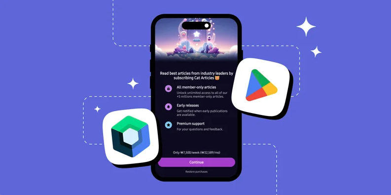
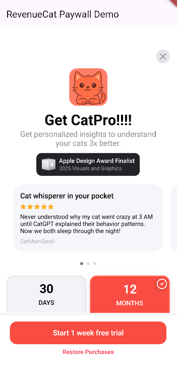

author: Jaewoong Eum
summary: RevenueCat React Native SDK Integration
id: codelab-5-react-native-sdk
categories: codelab,markdown
environments: Web
status: Published
feedback link: https://github.com/revenuecat/codelab/issues/new
analytics_ga4_account: G-MMFEH1TP0C

# React Native In-App Purchases & Paywalls

## React Native In-App Purchases & Paywalls Overview
Duration: 0:02:00

Welcome to [RevenueCat](https://www.revenuecat.com/)'s React Native SDK Codelab!

**Goal:** In this codelab, you will learn how to integrate the RevenueCat React Native SDK into a new React Native application to fetch product offerings and display a pre-built, native paywall UI.

**What you'll build:**

A simple one-screen app that shows a loading indicator, fetches your configured "Offering" from RevenueCat, and then displays the `RevenueCatUI` paywall.

### Prerequisites

Before you start, you must have the following set up:

1.  **React Native Environment:** Your React Native development environment should be ready with Node.js, React Native CLI, and required platform-specific tools.
2.  **Platform Requirements:**
    *   iOS: Minimum deployment target of 13.4
    *   Android: Minimum API level 23 (version 6.0)
    *   React Native version 0.64 or higher
3.  **RevenueCat Account:** A free account at [revenuecat.com](https://revenuecat.com).
4.  **App Store / Play Store Configuration:**
    *   An in-app product (subscription or one-time purchase) created in either App Store Connect or Google Play Console. If you want to learn more about configuring Google Play, check out [Codelab1: RevenueCat Google Play Integration](https://revenuecat.github.io/codelab/google-play/codelab-1-google-play-integration/index.html#0).
    *   This product linked to an **Entitlement** and an **Offering** within your RevenueCat dashboard. This is the most critical step. If you have no "Current" offering, the paywall will not show.
5.  **A Physical Device or Configured Emulator:** For testing in-app purchases.

By the end of this codelab, you'll be able to successfully implement in-app purchases in your React Native app and display dynamic paywalls using RevenueCat's React Native SDK.



## Import RevenueCat SDK
Duration: 0:05:00

First things first, before implementing in-app purchases, you'll need to import the RevenueCat SDK into your existing or new project. To get started, add the following dependency to your project:

You can check out the [latest release version on GitHub](https://github.com/RevenueCat/purchases-react-native/releases).

### Installation

Using npm:

```bash
npm install --save react-native-purchases
```

Or using yarn:

```bash
yarn add react-native-purchases
```

### Platform-Specific Configuration

#### iOS Setup

For iOS, you need to enable the "In-App Purchase" capability:

1. Open your project in Xcode
2. Select your project target
3. Go to "Signing & Capabilities"
4. Click "+ Capability" and add "In-App Purchase"

#### Android Setup

For Android, add the billing permission to your `AndroidManifest.xml`:

```xml
<uses-permission android:name="com.android.vending.BILLING" />
```

Also, ensure your Activity's `launchMode` is set to `standard` or `singleTop` in `AndroidManifest.xml`:

```xml
<activity
  android:name=".MainActivity"
  android:launchMode="standard"
  ...
/>
```

### Initialize RevenueCat SDK

Now, let's initialize the RevenueCat SDK. We will do this in your main `App.js` or `App.tsx` file.

1.  Open `App.js` (or `App.tsx` for TypeScript projects)
2.  Import the SDK at the top of the file
3.  **Paste your API keys** into the constants

```javascript
// App.js

import React, { useEffect, useState } from 'react';
import { Platform, View, Text, ActivityIndicator, StyleSheet } from 'react-native';
import Purchases from 'react-native-purchases';

// --- PASTE YOUR REVENUECAT KEYS HERE ---
const androidApiKey = 'goog_YOUR_KEY_HERE';
const iosApiKey = 'appl_YOUR_KEY_HERE';

const App = () => {
  const [isConfigured, setIsConfigured] = useState(false);

  useEffect(() => {
    const initializePurchases = async () => {
      try {
        // Enable debug logs for development
        Purchases.setLogLevel(Purchases.LOG_LEVEL.DEBUG);

        // Configure the SDK with the appropriate API key
        if (Platform.OS === 'ios') {
          await Purchases.configure({ apiKey: iosApiKey });
        } else if (Platform.OS === 'android') {
          await Purchases.configure({ apiKey: androidApiKey });
        }

        console.log('RevenueCat configured successfully!');
        setIsConfigured(true);
      } catch (e) {
        console.error('Error configuring RevenueCat:', e);
      }
    };

    initializePurchases();
  }, []);

  if (!isConfigured) {
    return (
      <View style={styles.centered}>
        <ActivityIndicator size="large" />
        <Text style={styles.loadingText}>Initializing RevenueCat...</Text>
      </View>
    );
  }

  // Main app content will go here in the next steps
  return (
    <View style={styles.container}>
      <Text>RevenueCat is ready!</Text>
    </View>
  );
};

const styles = StyleSheet.create({
  container: {
    flex: 1,
    justifyContent: 'center',
    alignItems: 'center',
    backgroundColor: '#fff',
  },
  centered: {
    flex: 1,
    justifyContent: 'center',
    alignItems: 'center',
  },
  loadingText: {
    marginTop: 10,
    fontSize: 16,
  },
});

export default App;
```

We just created a basic React Native app that initializes the RevenueCat SDK using the `useEffect` hook. This ensures the SDK is configured and ready before any purchases are made. This is the correct way to initialize plugins that need to be available right from the start.

Yes! You've now completed 50% of the implementation.

## Validating Entitlements
Duration: 0:03:00

Now let's move on to validating user entitlements.

As mentioned earlier, an entitlement represents the level of access or features a user unlocks after making a purchase. This makes it useful for determining things like whether to display an ad banner or grant premium access.

You can easily check if a user has an active entitlement using the code snippet below:

```javascript
const ENTITLEMENT_IDENTIFIER = ".."; // get specific entitlement identifier from your RevenueCat dashboard

try {
  const customerInfo = await Purchases.getCustomerInfo();
  const isEntitled = customerInfo.entitlements.active[ENTITLEMENT_IDENTIFIER]?.isActive;

  if (isEntitled) {
    // User has access to this entitlement
    console.log('User is entitled');
  } else {
    // User does not have access
    console.log('User is not entitled');
  }
} catch (e) {
  console.error('Error checking entitlement:', e);
}
```

Once you've checked whether the user has a specific entitlement, you can decide how to proceed based on your app's business model.

For example, if your app is ad-supported, you might choose to show or hide an AdMob banner. Alternatively, you could choose to display a paywall or purchase dialog, allowing users to unlock advanced features or content.

Here's an example of how you might implement that logic:

```javascript
if (isEntitled) {
  // if the user is granted access to this entitlement, don't need to display a banner.
} else {
  // display a banner UI here or display a paywall
}
```

## Implement In-App Purchases
Duration: 0:04:00

Now, let's implement in-app purchases to offer an ad-free experience. To get started, you'll first need to fetch the relevant product information from your RevenueCat dashboard. This product data will be used to present purchase options to your users.

You can retrieve the available products by calling `Purchases.getProducts()`, as shown in the example below:

```javascript
// Fetches the product information from the RevenueCat server
const products = await Purchases.getProducts(['paywall_tester.subs']);

// Proceed with in-app purchase
const purchaseResult = await Purchases.purchaseStoreProduct(products[0]);
```

If you offer multiple product variations, such as `paywall_tester.subs:weekly`, `paywall_tester.subs:monthly`, and `paywall_tester.subs:yearly`, you can simplify product retrieval by using the **base product identifier**, `paywall_tester.subs`, as the value for the `productIds` field. This tells RevenueCat to fetch **all related product variations** as a list, so you can dynamically present them in your paywall UI.

Once you've retrieved the product data, you can initiate the **in-app purchase flow** by calling `Purchases.purchaseStoreProduct(product)`. This will automatically trigger the **Google Play purchase dialog** or **Apple's purchase sheet**, enabling the user to complete the transaction within your app.

Just like that, you've integrated a fully functional **in-app purchase flow** with just a few lines of code—no need to deal with the complexity of handling receipts, store APIs, or purchase validation manually.

So the full example of code will look like below:

```javascript
import Purchases from 'react-native-purchases';

/**
 * Fetches a specific product by its ID and initiates the purchase flow.
 *
 * This function handles potential errors like the product not being found,
 * the user canceling the purchase, or other store errors.
 */
const purchaseProduct = async () => {
  // 1. Define the product identifier you want to fetch.
  const productId = 'paywall_tester.subs';

  try {
    // 2. Fetch the StoreProduct(s) from RevenueCat
    console.log('Fetching products...');
    const products = await Purchases.getProducts([productId]);

    // 3. Check if the product list is not empty
    if (products.length === 0) {
      console.error('Error: Product not found. Check the ID and your RevenueCat setup.');
      // Optionally, show an error message to the user
      return;
    }

    const productToPurchase = products[0];
    console.log('Product found:', productToPurchase.title, '. Initiating purchase...');

    // 4. Initiate the purchase flow
    const { customerInfo } = await Purchases.purchaseStoreProduct(productToPurchase);

    // 5. Check if the purchase was successful by verifying the entitlement
    // Replace "your_premium_entitlement" with your actual entitlement identifier from RevenueCat
    if (customerInfo.entitlements.active['your_premium_entitlement']?.isActive) {
      console.log('Purchase successful! User now has premium access.');
      // Grant access to premium content
    } else {
      console.log('Purchase completed, but entitlement is not active.');
    }
  } catch (e) {
    // 6. Handle potential errors
    if (e.code === Purchases.PURCHASES_ERROR_CODE.PURCHASE_CANCELLED_ERROR) {
      console.log('Purchase cancelled by user.');
    } else {
      console.error('Purchase failed with error:', e.message);
    }
  }
};
```

## Implement Paywalls
Duration: 0:07:00

Now, it's time to implement Paywalls in React Native.

### Step 1: Install RevenueCatUI Package

First, install the RevenueCatUI package that provides pre-built paywall components:

```bash
npm install --save react-native-purchases-ui
# or
yarn add react-native-purchases-ui
```

### Step 2: Import RevenueCatUI

Import the paywall presentation method at the top of your file:

```javascript
import { presentPaywallIfNeeded } from 'react-native-purchases-ui';
```

### Step 3: Fetch Offerings and Display Paywall

Let's update our `App.js` to fetch offerings and display the paywall. Replace your existing app code with:

```javascript
// App.js

import React, { useEffect, useState } from 'react';
import {
  Platform,
  View,
  Text,
  ActivityIndicator,
  StyleSheet,
  SafeAreaView,
} from 'react-native';
import Purchases from 'react-native-purchases';
import { presentPaywallIfNeeded } from 'react-native-purchases-ui';

// --- PASTE YOUR REVENUECAT KEYS HERE ---
const androidApiKey = 'goog_YOUR_KEY_HERE';
const iosApiKey = 'appl_YOUR_KEY_HERE';

const App = () => {
  const [isConfigured, setIsConfigured] = useState(false);
  const [isLoading, setIsLoading] = useState(true);
  const [offering, setOffering] = useState(null);
  const [errorMessage, setErrorMessage] = useState(null);

  useEffect(() => {
    const initializePurchases = async () => {
      try {
        // Enable debug logs for development
        Purchases.setLogLevel(Purchases.LOG_LEVEL.DEBUG);

        // Configure the SDK with the appropriate API key
        if (Platform.OS === 'ios') {
          await Purchases.configure({ apiKey: iosApiKey });
        } else if (Platform.OS === 'android') {
          await Purchases.configure({ apiKey: androidApiKey });
        }

        console.log('RevenueCat configured successfully!');
        setIsConfigured(true);
      } catch (e) {
        console.error('Error configuring RevenueCat:', e);
        setErrorMessage('Failed to initialize RevenueCat');
        setIsLoading(false);
      }
    };

    initializePurchases();
  }, []);

  useEffect(() => {
    if (!isConfigured) return;

    const loadOfferings = async () => {
      try {
        setIsLoading(true);
        setErrorMessage(null);

        // Get the current offerings from RevenueCat
        const offerings = await Purchases.getOfferings();

        if (offerings.current !== null) {
          setOffering(offerings.current);
        } else {
          setErrorMessage('No current offering found. Check your RevenueCat dashboard.');
        }
      } catch (e) {
        console.error('Error fetching offerings:', e);
        setErrorMessage(`Failed to load offerings: ${e.message}`);
      } finally {
        setIsLoading(false);
      }
    };

    loadOfferings();
  }, [isConfigured]);

  useEffect(() => {
    if (!offering) return;

    const showPaywall = async () => {
      try {
        const paywallResult = await presentPaywallIfNeeded({
          offering: offering,
        });

        console.log('Paywall result:', paywallResult);

        if (paywallResult === Purchases.PAYWALL_RESULT.PURCHASED) {
          console.log('User made a purchase!');
        } else if (paywallResult === Purchases.PAYWALL_RESULT.RESTORED) {
          console.log('User restored purchases!');
        } else if (paywallResult === Purchases.PAYWALL_RESULT.CANCELLED) {
          console.log('User cancelled the paywall');
        }
      } catch (e) {
        console.error('Error presenting paywall:', e);
      }
    };

    showPaywall();
  }, [offering]);

  if (isLoading) {
    return (
      <SafeAreaView style={styles.centered}>
        <ActivityIndicator size="large" color="#6366f1" />
        <Text style={styles.loadingText}>Loading Paywall...</Text>
      </SafeAreaView>
    );
  }

  if (errorMessage) {
    return (
      <SafeAreaView style={styles.centered}>
        <Text style={styles.errorText}>{errorMessage}</Text>
      </SafeAreaView>
    );
  }

  return (
    <SafeAreaView style={styles.container}>
      <Text style={styles.title}>RevenueCat Paywall Demo</Text>
      <Text style={styles.subtitle}>Paywall displayed successfully!</Text>
    </SafeAreaView>
  );
};

const styles = StyleSheet.create({
  container: {
    flex: 1,
    justifyContent: 'center',
    alignItems: 'center',
    backgroundColor: '#fff',
    padding: 20,
  },
  centered: {
    flex: 1,
    justifyContent: 'center',
    alignItems: 'center',
    backgroundColor: '#fff',
  },
  loadingText: {
    marginTop: 16,
    fontSize: 16,
    color: '#666',
  },
  errorText: {
    fontSize: 16,
    color: '#ef4444',
    textAlign: 'center',
    padding: 20,
  },
  title: {
    fontSize: 24,
    fontWeight: 'bold',
    marginBottom: 8,
    color: '#111',
  },
  subtitle: {
    fontSize: 16,
    color: '#666',
  },
});

export default App;
```

**What did we just do?**
1.  We created state variables to manage loading states, offerings, and error messages.
2.  We first initialize RevenueCat SDK when the component mounts.
3.  Once configured, we fetch offerings using `Purchases.getOfferings()`.
4.  When an offering is available, we automatically present the paywall using `presentPaywallIfNeeded()`.
5.  We handle various paywall results including purchases, restores, and cancellations.

### Step 4: Run Your Application

You're Done!

Now, run your application on a device or emulator:

For iOS:
```bash
npx react-native run-ios
```

For Android:
```bash
npx react-native run-android
```

You should see:
1.  A "Loading Paywall..." message with a spinner.
2.  Followed by your fully functional, native paywall UI like the image below.



### Troubleshooting

If the paywall doesn't appear, check the debug console and review these common issues:
*   **"No current offering found"**: This is the most common error. It means your RevenueCat dashboard is missing a "current" offering. Go to **Offerings**, select an offering, and make sure it's marked as "current".
*   **Incorrect API Keys**: Double-check that you've copied the correct public API key for the platform you're testing.
*   **Products Not Configured**: Ensure your in-app products in the store consoles are correctly set up and linked to an entitlement and offering in RevenueCat.
*   **Sandbox/Test User Issues**: Make sure you are logged in with a sandbox tester account (iOS) or your email is added as a license tester (Android).
*   **Platform-Specific Issues**:
    *   iOS: Verify In-App Purchase capability is enabled in Xcode
    *   Android: Check that BILLING permission is in AndroidManifest.xml

Configuration! 🥳 Now, you'll be able to display paywalls whenever a user doesn't have the required entitlement, using the exact same design you configured in the Paywall Editor.

As you've already seen in the [Codelab: RevenueCat Google Play Integration (Create Paywalls)](https://revenuecat.github.io/codelab-internal-testing/google-play/codelab-1-google-play-integration/index.html#7), the paywall system is built on a **server-driven UI**. This means you can dynamically update the paywall's content and design directly from the dashboard without needing to push app updates or go through the review process.

## Conclusion

In this codelab, you've learned how to integrate RevenueCat's React Native SDK, implement in-app purchases, and build paywalls in React Native. Now it's time to ship your app and make more money! 💰

You can also learn more about using the RevenueCat SDK with the resources below:

- [Product Tutorials](https://www.revenuecat.com/tutorials/): Video tutorials to help you get started and get the most out of RevenueCat.
- [React Native SDK Reference](https://www.revenuecat.com/docs/getting-started/installation/reactnative): Complete SDK documentation for React Native.
- [RevenueCat Community](https://community.revenuecat.com/): Join our community to ask questions and share your experience.
