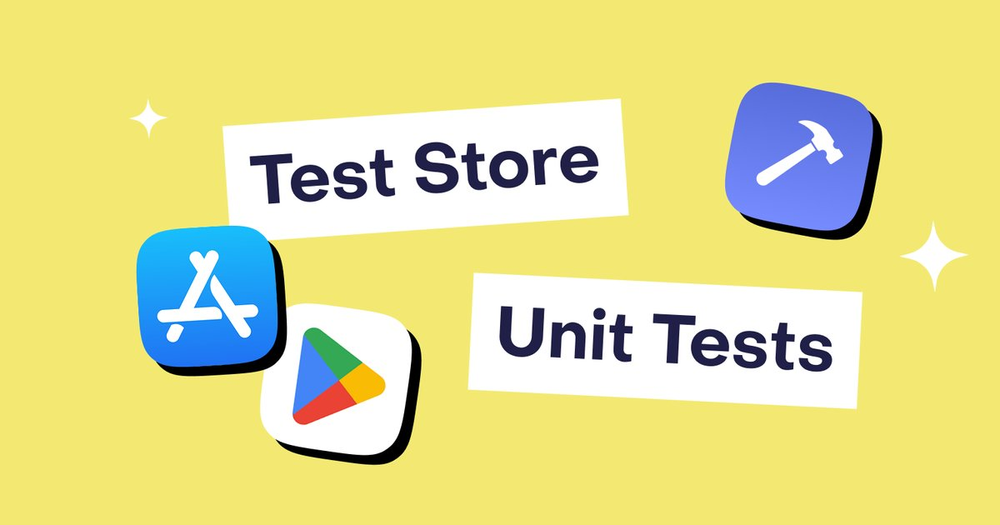
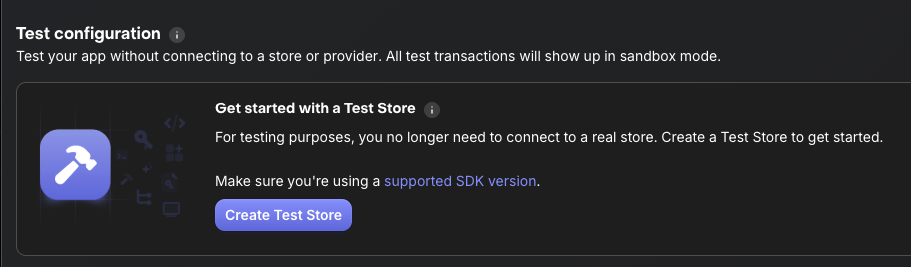
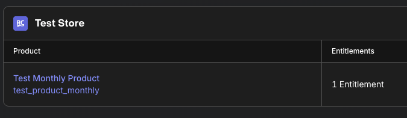
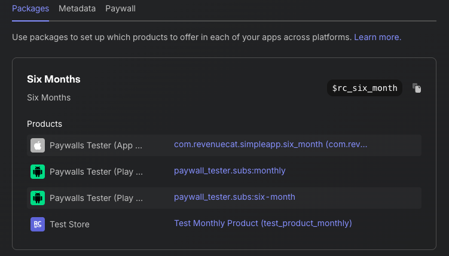

author: Jaewoong Eum
summary: Set up Test Store for Android
id: codelab-test-store-android
categories: codelab,markdown
environments: Web
status: Published
feedback link: https://github.com/revenuecat/codelab/issues/new
analytics_ga4_account: G-MMFEH1TP0C

# Set up Test Store for Android

## Test Store Overview
Duration: 0:02:00

Welcome to the **RevenueCat Test Store** setup guide for Android!

Testing in-app purchases has always been challenging. You need to configure sandbox accounts, create test products, wait for app review, and deal with flaky network conditions. **RevenueCat's Test Store** eliminates these pain points by providing a deterministic, fast, and reliable testing environment.

### What is Test Store?

Test Store is RevenueCat's built-in testing environment that allows you to test in-app purchase flows without connecting to Google Play Store. It's automatically provisioned with every new RevenueCat project and gives you complete control over purchase outcomes.

### What you'll learn

This codelab will guide you through the complete process of setting up and using RevenueCat's Test Store for Android development. You'll start by enabling Test Store in your RevenueCat dashboard and configuring your Android application to use Test Store API keys. Then, you'll learn how to test purchase flows with deterministic outcomes, write automated unit tests for your in-app purchase logic, and integrate these tests into your CI/CD pipeline using GitHub Actions.

### Benefits of Test Store

Test Store revolutionizes how you test in-app purchases. Unlike traditional testing methods that require you to wait for Google Play configuration or app approval, Test Store provides instant testing capabilities. You get complete deterministic control over purchase outcomes: whether a transaction succeeds, fails, or gets cancelled is entirely up to you. This means no more dealing with flaky network connections or unreliable sandbox environments.

The real power comes when you start writing automated tests. With Test Store, you can build reliable unit tests for your purchase logic that run consistently in any environment, including CI/CD systems like GitHub Actions. This enables you to iterate quickly on your purchase flows, testing changes in seconds rather than minutes or hours.



### Prerequisites

Before you start, ensure you have:

1. A **RevenueCat account** (free at [revenuecat.com](https://revenuecat.com))
2. An Android project with **RevenueCat SDK** integrated (version 8.0.0 or higher)
3. Basic knowledge of **Kotlin** and **Android development**
4. Familiarity with **Jetpack Compose** (optional, for UI examples)

## Enable Test Store in Dashboard
Duration: 0:03:00

The first step is to enable Test Store in your RevenueCat dashboard and obtain your Test Store API key.

### Access the Dashboard

Start by logging into your [RevenueCat dashboard](https://app.revenuecat.com/) and navigating to the **Apps & providers** section in the left sidebar menu. This is where you'll find all your connected apps and available store integrations.

### Create Your Test Store

In the Apps & providers section, look for the **Test Store** option among the available providers. Test Store is automatically provisioned for every RevenueCat project, so you'll simply need to activate it by clicking **Create Test Store** or **Enable Test Store**. The setup is instant with no waiting for approvals or configuration sync.

### Get Your API Key

Once Test Store is enabled, click on the Test Store entry in your apps list to view its details. Here you'll find your **Test Store API Key**, which starts with the prefix `test_`. This key functions just like a regular RevenueCat API key, but with one crucial difference: it routes all purchase requests to Test Store instead of Google Play, giving you full control over the testing environment.

**Understanding API Key Separation:** Test Store API keys are completely separate from your production and sandbox keys. This separation is intentional and important for security. Never use Test Store keys in production builds; they should only be used in debug and test environments. You can create multiple Test Store configurations per project if needed for different testing scenarios.



### What's Next?

Now that you have your Test Store API key, you're ready to configure your Android application to use Test Store for testing.

## Configure Test Store in Android App
Duration: 0:05:00

Now let's configure your Android application to use Test Store. The key is to use your Test Store API key instead of your production API key when running tests.

### Step 1: Create BuildConfig Fields

Add Test Store API key configuration to your app's `build.gradle.kts`:

```kotlin
android {
    defaultConfig {
        // Your existing configuration

        // Add Test Store API key for debug builds
        buildConfigField("String", "REVENUECAT_TEST_STORE_API_KEY", "\"test_YOUR_KEY_HERE\"")
    }

    buildTypes {
        debug {
            // Use Test Store for debug builds
            buildConfigField("String", "REVENUECAT_API_KEY", "\"test_YOUR_KEY_HERE\"")
        }
        release {
            // Use production API key for release builds
            buildConfigField("String", "REVENUECAT_API_KEY", "\"goog_YOUR_PRODUCTION_KEY\"")
        }
    }
}
```

### Step 2: Initialize SDK with Test Store

Update your Application class to use the appropriate API key based on build type:

```kotlin
class MyApplication : Application() {
    override fun onCreate() {
        super.onCreate()

        // Initialize RevenueCat SDK
        val apiKey = BuildConfig.REVENUECAT_API_KEY

        val builder = PurchasesConfiguration.Builder(this, apiKey)
        Purchases.configure(
            builder
                .purchasesAreCompletedBy(PurchasesAreCompletedBy.REVENUECAT)
                .appUserID(null)
                .diagnosticsEnabled(true)
                .build()
        )

        // Enable debug logs for test builds
        if (BuildConfig.DEBUG) {
            Purchases.logLevel = LogLevel.DEBUG
        }
    }
}
```

### Step 3: Environment-Specific Configuration

For more advanced setups, you can create a configuration class:

```kotlin
object RevenueCatConfig {
    fun getApiKey(context: Context): String {
        return if (isTestEnvironment()) {
            BuildConfig.REVENUECAT_TEST_STORE_API_KEY
        } else {
            BuildConfig.REVENUECAT_API_KEY
        }
    }

    private fun isTestEnvironment(): Boolean {
        // Check if running in test environment
        return try {
            Class.forName("androidx.test.espresso.Espresso")
            true
        } catch (e: ClassNotFoundException) {
            false
        } || BuildConfig.DEBUG
    }
}
```

Then use it in your initialization:

```kotlin
val apiKey = RevenueCatConfig.getApiKey(this)
Purchases.configure(
    PurchasesConfiguration.Builder(this, apiKey)
        .purchasesAreCompletedBy(PurchasesAreCompletedBy.REVENUECAT)
        .build()
)
```

### Verification

To verify Test Store is working:

1. Run your app in debug mode
2. Check the logs for `"Purchases SDK initialized with Test Store"`
3. The SDK will indicate it's connected to Test Store instead of Google Play



## Test Purchase Flows Interactively
Duration: 0:05:00

With Test Store enabled, you can now test purchase flows with complete control over outcomes. When Test Store shows its purchase dialog, **you** decide the result.

### Understanding Test Store Purchase Dialog

When you initiate a purchase with Test Store, you'll see a custom Test Store dialog instead of the standard Google Play purchase sheet. This dialog displays the product details and price just like a real purchase dialog, but with one key difference: you get to control the outcome. The dialog presents three clear options: **Successful Purchase** to simulate a completed transaction, **Failed Purchase** to test payment failures, and **Cancel** to simulate user cancellation. This deterministic behavior is what makes Test Store so powerful for testing.

### Testing Success Flow

Let's test a successful purchase flow:

```kotlin
suspend fun purchaseProduct(activity: Activity) {
    try {
        // Fetch products from Test Store
        val products = Purchases.sharedInstance.awaitGetProducts(
            productIds = listOf("premium_monthly")
        )

        // Initiate purchase
        val purchaseResult = Purchases.sharedInstance.awaitPurchase(
            purchaseParams = PurchaseParams.Builder(
                activity = activity,
                storeProduct = products.first()
            ).build()
        )

        // Check the result
        val customerInfo = purchaseResult.customerInfo
        val isPremium = customerInfo.entitlements["premium"]?.isActive == true

        if (isPremium) {
            // Purchase successful!
            showPremiumContent()
        }
    } catch (e: PurchasesException) {
        // Handle error
        handlePurchaseError(e)
    }
}
```

**Testing the Happy Path:** Run your app and trigger the purchase flow as you normally would. When the Test Store dialog appears, tap **"Successful Purchase"**. Your app should immediately grant premium access, and you can verify that the entitlements are properly updated. This lets you quickly validate that your success flow works correctly without needing a real payment method or sandbox account.

### Testing Failure Scenarios

Now test how your app handles failures:

```kotlin
fun handlePurchaseError(error: PurchasesException) {
    when (error.code) {
        PurchasesErrorCode.PURCHASE_CANCELLED_ERROR -> {
            // User cancelled - don't show error
            Log.d("Purchase", "User cancelled purchase")
        }
        PurchasesErrorCode.PURCHASE_INVALID_ERROR -> {
            // Invalid purchase
            showError("This purchase is not available")
        }
        PurchasesErrorCode.PAYMENT_PENDING_ERROR -> {
            // Payment pending (e.g., awaiting parental approval)
            showPendingMessage()
        }
        else -> {
            // Other errors
            showError("Purchase failed: ${error.message}")
        }
    }
}
```

**Testing Error Handling:** Trigger the purchase flow again, but this time when the Test Store dialog appears, tap **"Failed Purchase"**. Your app should gracefully handle the error, showing an appropriate error message to the user. Confirm that the user doesn't receive premium access and that your app's state remains consistent. This is crucial for ensuring your error handling logic works correctly in production.

### Testing Cancellation

```kotlin
@Composable
fun PaywallScreen(onDismiss: () -> Unit) {
    val scope = rememberCoroutineScope()
    var isPurchasing by remember { mutableStateOf(false) }

    Button(
        onClick = {
            scope.launch {
                isPurchasing = true
                try {
                    purchaseProduct(LocalContext.current as Activity)
                } catch (e: PurchasesException) {
                    if (e.code == PurchasesErrorCode.PURCHASE_CANCELLED_ERROR) {
                        // User cancelled - just dismiss
                        onDismiss()
                    }
                }
                isPurchasing = false
            }
        },
        enabled = !isPurchasing
    ) {
        Text(if (isPurchasing) "Processing..." else "Subscribe")
    }
}
```

**Testing User Cancellation:** Open your paywall and tap the subscribe button. When the Test Store dialog appears, tap **"Cancel"** to simulate a user backing out of the purchase. Your paywall should dismiss cleanly without showing any error messages (cancellation is a normal user action, not an error state). Verify that no purchase was recorded and your app's state is unchanged.

### Key Takeaways

The beauty of Test Store lies in its deterministic control. You decide exactly what happens with each purchase attempt. This means you can thoroughly test all scenarios (success, failure, and cancellation) in a matter of minutes, without needing real payment methods or dealing with the delays and complexities of sandbox accounts. By the time you're ready to integrate with Google Play, you'll have confidence that your purchase handling logic is rock-solid.



## Write Automated Unit Tests
Duration: 0:08:00

One of Test Store's most powerful features is enabling **automated unit testing** of your in-app purchase logic. Let's write tests that run reliably in CI/CD.

### Step 1: Add Test Dependencies

Add the following to your `build.gradle.kts`:

```kotlin
dependencies {
    // RevenueCat SDK
    implementation("com.revenuecat.purchases:purchases:8.20.0")

    // Testing dependencies
    testImplementation("junit:junit:4.13.2")
    testImplementation("org.jetbrains.kotlinx:kotlinx-coroutines-test:1.7.3")
    testImplementation("io.mockk:mockk:1.13.8")
    androidTestImplementation("androidx.test.ext:junit:1.1.5")
    androidTestImplementation("androidx.test:runner:1.5.2")
}
```

### Step 2: Create Purchase Repository

First, let's create a testable purchase repository:

```kotlin
interface PurchaseRepository {
    suspend fun getProducts(productIds: List<String>): List<StoreProduct>
    suspend fun purchaseProduct(activity: Activity, product: StoreProduct): CustomerInfo
    suspend fun getCustomerInfo(): CustomerInfo
}

class PurchaseRepositoryImpl(
    private val purchases: Purchases = Purchases.sharedInstance
) : PurchaseRepository {

    override suspend fun getProducts(productIds: List<String>): List<StoreProduct> {
        return purchases.awaitGetProducts(productIds)
    }

    override suspend fun purchaseProduct(
        activity: Activity,
        product: StoreProduct
    ): CustomerInfo {
        val result = purchases.awaitPurchase(
            PurchaseParams.Builder(activity, product).build()
        )
        return result.customerInfo
    }

    override suspend fun getCustomerInfo(): CustomerInfo {
        return purchases.awaitCustomerInfo()
    }
}
```

### Step 3: Create View Model with Business Logic

```kotlin
class PaywallViewModel(
    private val repository: PurchaseRepository
) : ViewModel() {

    private val _state = MutableStateFlow<PaywallState>(PaywallState.Loading)
    val state: StateFlow<PaywallState> = _state.asStateFlow()

    fun loadProducts() {
        viewModelScope.launch {
            try {
                val products = repository.getProducts(listOf("premium_monthly"))
                _state.value = PaywallState.Success(products)
            } catch (e: Exception) {
                _state.value = PaywallState.Error(e.message ?: "Unknown error")
            }
        }
    }

    fun purchaseProduct(activity: Activity, product: StoreProduct) {
        viewModelScope.launch {
            _state.value = PaywallState.Purchasing
            try {
                val customerInfo = repository.purchaseProduct(activity, product)
                val isPremium = customerInfo.entitlements["premium"]?.isActive == true

                if (isPremium) {
                    _state.value = PaywallState.PurchaseSuccess
                } else {
                    _state.value = PaywallState.Error("Purchase completed but entitlement not active")
                }
            } catch (e: PurchasesException) {
                when (e.code) {
                    PurchasesErrorCode.PURCHASE_CANCELLED_ERROR -> {
                        _state.value = PaywallState.PurchaseCancelled
                    }
                    else -> {
                        _state.value = PaywallState.Error(e.message)
                    }
                }
            }
        }
    }
}

sealed class PaywallState {
    object Loading : PaywallState()
    data class Success(val products: List<StoreProduct>) : PaywallState()
    object Purchasing : PaywallState()
    object PurchaseSuccess : PaywallState()
    object PurchaseCancelled : PaywallState()
    data class Error(val message: String) : PaywallState()
}
```

### Step 4: Write Unit Tests

Now create unit tests using Test Store:

```kotlin
@RunWith(AndroidJUnit4::class)
class PaywallViewModelTest {

    private lateinit var repository: PurchaseRepository
    private lateinit var viewModel: PaywallViewModel

    @Before
    fun setup() {
        // Initialize RevenueCat with Test Store API key
        Purchases.configure(
            PurchasesConfiguration.Builder(
                ApplicationProvider.getApplicationContext(),
                "test_YOUR_KEY_HERE"
            ).build()
        )

        repository = PurchaseRepositoryImpl()
        viewModel = PaywallViewModel(repository)
    }

    @Test
    fun testLoadProducts_Success() = runTest {
        // Given: ViewModel is initialized

        // When: Loading products
        viewModel.loadProducts()

        // Wait for state to update
        advanceUntilIdle()

        // Then: Products should be loaded successfully
        val state = viewModel.state.value
        assertTrue(state is PaywallState.Success)
        assertFalse((state as PaywallState.Success).products.isEmpty())
    }

    @Test
    fun testPurchaseProduct_Success() = runTest {
        // Given: Products are loaded
        viewModel.loadProducts()
        advanceUntilIdle()

        val state = viewModel.state.value as PaywallState.Success
        val product = state.products.first()

        // When: User purchases product and Test Store dialog shows "Successful Purchase"
        // Note: In actual test, you'll need to interact with Test Store dialog
        viewModel.purchaseProduct(mockActivity, product)
        advanceUntilIdle()

        // Then: Purchase should succeed and entitlement should be active
        val finalState = viewModel.state.value
        assertTrue(finalState is PaywallState.PurchaseSuccess)
    }

    @Test
    fun testPurchaseProduct_Cancelled() = runTest {
        // Given: Products are loaded
        viewModel.loadProducts()
        advanceUntilIdle()

        val state = viewModel.state.value as PaywallState.Success
        val product = state.products.first()

        // When: User cancels purchase in Test Store dialog
        viewModel.purchaseProduct(mockActivity, product)
        advanceUntilIdle()

        // Then: State should indicate cancellation
        val finalState = viewModel.state.value
        assertTrue(finalState is PaywallState.PurchaseCancelled)
    }
}
```

### Step 5: Mock-Based Testing Alternative

For even more control, you can mock the repository:

```kotlin
class PaywallViewModelMockTest {

    private lateinit var mockRepository: PurchaseRepository
    private lateinit var viewModel: PaywallViewModel

    @Before
    fun setup() {
        mockRepository = mockk()
        viewModel = PaywallViewModel(mockRepository)
    }

    @Test
    fun testPurchaseSuccess() = runTest {
        // Given: Mock successful purchase
        val mockProduct = mockk<StoreProduct>()
        val mockCustomerInfo = mockk<CustomerInfo> {
            every { entitlements["premium"]?.isActive } returns true
        }

        coEvery {
            mockRepository.purchaseProduct(any(), mockProduct)
        } returns mockCustomerInfo

        // When: Purchase is initiated
        viewModel.purchaseProduct(mockk(), mockProduct)
        advanceUntilIdle()

        // Then: State should be success
        assertTrue(viewModel.state.value is PaywallState.PurchaseSuccess)
    }

    @Test
    fun testPurchaseFailed() = runTest {
        // Given: Mock failed purchase
        val mockProduct = mockk<StoreProduct>()

        coEvery {
            mockRepository.purchaseProduct(any(), mockProduct)
        } throws PurchasesException(
            PurchasesErrorCode.PAYMENT_PENDING_ERROR,
            "Payment is pending"
        )

        // When: Purchase is initiated
        viewModel.purchaseProduct(mockk(), mockProduct)
        advanceUntilIdle()

        // Then: State should show error
        val state = viewModel.state.value
        assertTrue(state is PaywallState.Error)
        assertTrue((state as PaywallState.Error).message.contains("pending"))
    }
}
```

### Why This Approach Works

This testing approach eliminates the traditional pain points of testing in-app purchases. Because Test Store has no network dependencies, your tests run reliably every single time. No more flaky failures due to connection issues. Tests execute in seconds rather than minutes, giving you rapid feedback during development. You can achieve complete test coverage across all scenarios, including edge cases that would be difficult or time-consuming to reproduce with real payment systems.

The architecture we've built (with the repository pattern separating business logic from the SDK) makes these tests both fast and maintainable. You can run them in any CI/CD environment like GitHub Actions, catching bugs before they ever reach production.

## Run Tests in CI/CD
Duration: 0:04:00

Now let's configure your tests to run automatically in GitHub Actions, ensuring your purchase logic stays reliable with every code change.

### Step 1: Create GitHub Actions Workflow

Create `.github/workflows/android-tests.yml`:

```yaml
name: Android Tests

on:
  push:
    branches: [ main, develop ]
  pull_request:
    branches: [ main, develop ]

jobs:
  test:
    runs-on: ubuntu-latest

    steps:
      - name: Checkout code
        uses: actions/checkout@v4

      - name: Set up JDK 17
        uses: actions/setup-java@v4
        with:
          java-version: '17'
          distribution: 'temurin'

      - name: Cache Gradle packages
        uses: actions/cache@v3
        with:
          path: |
            ~/.gradle/caches
            ~/.gradle/wrapper
          key: ${{ runner.os }}-gradle-${{ hashFiles('**/*.gradle*', '**/gradle-wrapper.properties') }}
          restore-keys: |
            ${{ runner.os }}-gradle-

      - name: Grant execute permission for gradlew
        run: chmod +x gradlew

      - name: Run unit tests
        env:
          REVENUECAT_TEST_STORE_API_KEY: ${{ secrets.REVENUECAT_TEST_STORE_API_KEY }}
        run: ./gradlew testDebugUnitTest

      - name: Upload test results
        if: always()
        uses: actions/upload-artifact@v3
        with:
          name: test-results
          path: app/build/test-results/

      - name: Upload test reports
        if: always()
        uses: actions/upload-artifact@v3
        with:
          name: test-reports
          path: app/build/reports/tests/
```

### Step 2: Add Test Store API Key to GitHub Secrets

1. Go to your GitHub repository
2. Navigate to **Settings** → **Secrets and variables** → **Actions**
3. Click **New repository secret**
4. Name: `REVENUECAT_TEST_STORE_API_KEY`
5. Value: Your Test Store API key (e.g., `test_xxxxx`)
6. Click **Add secret**

### Step 3: Configure Gradle to Use Secret

Update your `build.gradle.kts` to use the environment variable:

```kotlin
android {
    defaultConfig {
        // Get Test Store API key from environment or use placeholder
        val testStoreApiKey = System.getenv("REVENUECAT_TEST_STORE_API_KEY")
            ?: "test_placeholder"

        buildConfigField("String", "REVENUECAT_TEST_STORE_API_KEY", "\"$testStoreApiKey\"")
    }
}
```

### Step 4: Run Instrumented Tests with Emulator

For more advanced testing, add instrumented tests:

```yaml
  instrumented-test:
    runs-on: ubuntu-latest

    steps:
      - name: Checkout code
        uses: actions/checkout@v4

      - name: Set up JDK 17
        uses: actions/setup-java@v4
        with:
          java-version: '17'
          distribution: 'temurin'

      - name: Enable KVM (for faster emulator)
        run: |
          echo 'KERNEL=="kvm", GROUP="kvm", MODE="0666", OPTIONS+="static_node=kvm"' | sudo tee /etc/udev/rules.d/99-kvm4all.rules
          sudo udevadm control --reload-rules
          sudo udevadm trigger --name-match=kvm

      - name: Grant execute permission for gradlew
        run: chmod +x gradlew

      - name: Run instrumented tests
        uses: reactivecircus/android-emulator-runner@v2
        env:
          REVENUECAT_TEST_STORE_API_KEY: ${{ secrets.REVENUECAT_TEST_STORE_API_KEY }}
        with:
          api-level: 29
          target: default
          arch: x86_64
          profile: Nexus 6
          script: ./gradlew connectedDebugAndroidTest

      - name: Upload instrumented test results
        if: always()
        uses: actions/upload-artifact@v3
        with:
          name: instrumented-test-results
          path: app/build/outputs/androidTest-results/
```

### Verify Your Setup

Commit and push your changes to trigger the workflow. Head over to the GitHub **Actions** tab in your repository to watch your tests run automatically. You'll see real-time progress as the workflow checks out your code, sets up the environment, and runs your test suite. Within a few minutes, you'll know whether all tests pass in the CI environment.

### The Power of Automated Testing

Once this is set up, every pull request gets validated automatically before it can be merged. You'll get immediate feedback if any changes break your purchase logic, without having to manually test every scenario. Test Store ensures that your tests produce consistent results across every run, eliminating the frustration of flaky tests. This creates a quality gate that prevents buggy code from reaching your main branch, while saving countless hours that would otherwise be spent on repetitive manual testing.

## Best Practices & Production Setup
Duration: 0:03:00

Now that you've set up Test Store, let's cover best practices and how to transition between Test Store and production environments.

### Environment Separation

Always keep Test Store and production keys separate:

```kotlin
object RevenueCatKeys {
    // Test Store - for testing only
    const val TEST_STORE_KEY = "test_xxxxx"

    // Google Play - for production
    const val GOOGLE_PLAY_KEY = "goog_xxxxx"

    fun getApiKey(isTestMode: Boolean): String {
        return if (isTestMode) TEST_STORE_KEY else GOOGLE_PLAY_KEY
    }
}
```

### Build Variant Configuration

Use build variants to automatically switch between environments:

```kotlin
android {
    buildTypes {
        debug {
            buildConfigField("String", "RC_API_KEY", "\"test_xxxxx\"")
            buildConfigField("Boolean", "USE_TEST_STORE", "true")
        }

        release {
            buildConfigField("String", "RC_API_KEY", "\"goog_xxxxx\"")
            buildConfigField("Boolean", "USE_TEST_STORE", "false")
        }
    }

    flavorDimensions += "environment"
    productFlavors {
        create("dev") {
            dimension = "environment"
            buildConfigField("String", "RC_API_KEY", "\"test_xxxxx\"")
        }

        create("staging") {
            dimension = "environment"
            buildConfigField("String", "RC_API_KEY", "\"test_xxxxx\"")
        }

        create("prod") {
            dimension = "environment"
            buildConfigField("String", "RC_API_KEY", "\"goog_xxxxx\"")
        }
    }
}
```

### Building a Comprehensive Testing Strategy

A robust testing strategy for in-app purchases should follow a pyramid approach. Start with unit tests using Test Store to validate your purchase logic in isolation. These run fast and catch most issues early. Build on that foundation with integration tests, also using Test Store, to verify complete purchase flows end-to-end. Once you're confident in your implementation, move to manual testing with Google Play Sandbox to verify platform integration. Finally, do a small-scale production test with real payments to ensure everything works in the live environment.

### Choosing Between Test Store and Sandbox

During initial development and iteration, Test Store is your best friend. It's perfect for rapid prototyping of purchase flows, writing unit and integration tests, and testing error handling and edge cases. The instant feedback loop makes it ideal for CI/CD automated testing where you need reliable, fast results.

Switch to Google Play Sandbox when you need to test platform-specific features that Test Store doesn't simulate. This includes pending transactions (like those awaiting parental approval), receipt validation specifics, subscription renewal cycles, and region-specific pricing. Think of Sandbox as your pre-production validation environment. Use it after your core logic is solid and you need to verify Google Play integration.

### Security Best Practices

Never expose your Test Store API key in production:

```kotlin
// ❌ BAD: Hardcoded keys
val apiKey = "test_xxxxx"

// ✅ GOOD: Environment-based configuration
val apiKey = if (BuildConfig.DEBUG) {
    BuildConfig.TEST_STORE_API_KEY
} else {
    BuildConfig.GOOGLE_PLAY_API_KEY
}

// ✅ BETTER: Check for test environment
val apiKey = when {
    isRunningInTests() -> BuildConfig.TEST_STORE_API_KEY
    BuildConfig.DEBUG -> BuildConfig.TEST_STORE_API_KEY
    else -> BuildConfig.GOOGLE_PLAY_API_KEY
}
```

### Logging and Debugging

Enable appropriate logging levels:

```kotlin
if (BuildConfig.USE_TEST_STORE) {
    Purchases.logLevel = LogLevel.VERBOSE
    Log.d("RevenueCat", "Using Test Store for testing")
} else if (BuildConfig.DEBUG) {
    Purchases.logLevel = LogLevel.DEBUG
} else {
    Purchases.logLevel = LogLevel.INFO
}
```

### Transitioning to Production

Before shipping your app, ensure you've completed a thorough checklist. All your tests should pass with Test Store, and you should have manually verified the integration with Google Play Sandbox. Double-check that your build variants are properly configured to use the right API keys in each environment. Production API keys must be secured and never committed to version control. Verify that Test Store keys are completely removed from release builds; they should only exist in debug configurations. Make sure logging is appropriately configured (verbose in debug, minimal in production), and confirm that your error handling has been tested across all scenarios.

## Conclusion

Congratulations! 🎉 You've successfully set up RevenueCat's Test Store for Android. Throughout this codelab, you've learned how to enable Test Store in your RevenueCat dashboard, configure Test Store API keys in your Android application, test purchase flows with deterministic outcomes, write automated unit tests for your purchase logic, run those tests in CI/CD environments like GitHub Actions, and follow best practices for environment separation.

### Key Takeaways

Test Store fundamentally changes how you approach in-app purchase testing. Gone are the days of wrestling with sandbox accounts and dealing with flaky network-dependent tests. With deterministic control over purchase outcomes, you can write reliable tests that give you true confidence in your implementation. The CI/CD integration means your purchase logic is continuously validated with every code change, enabling you to iterate on purchase flows in seconds instead of hours. Most importantly, you'll catch purchase-related bugs before they ever reach production, protecting both your revenue and user experience.

### Next Steps

Now that you have Test Store set up, it's time to build on this foundation. Start by writing comprehensive tests covering all your purchase scenarios. Don't just test the happy path. Integrate these tests into your CI/CD pipeline so they run automatically on every pull request. Thoroughly test your error handling with different failure modes to ensure your app degrades gracefully. When you're ready, transition to Google Play Sandbox for platform-specific testing to verify things like subscription renewals. Finally, ship with confidence, knowing that your purchase logic has been thoroughly validated at every step.

### Additional Resources

* [RevenueCat Test Store Blog Post](https://www.revenuecat.com/blog/engineering/testing-test-store/)
* [RevenueCat Android SDK Documentation](https://www.revenuecat.com/docs/getting-started/installation/android)
* [Testing Guide](https://www.revenuecat.com/docs/guides/testing-guide)
* [GitHub: Cat Paywall Compose](https://github.com/RevenueCat/cat-paywall-compose/)
* [Product Tutorials](https://www.revenuecat.com/tutorials/)

Happy testing! 🚀
